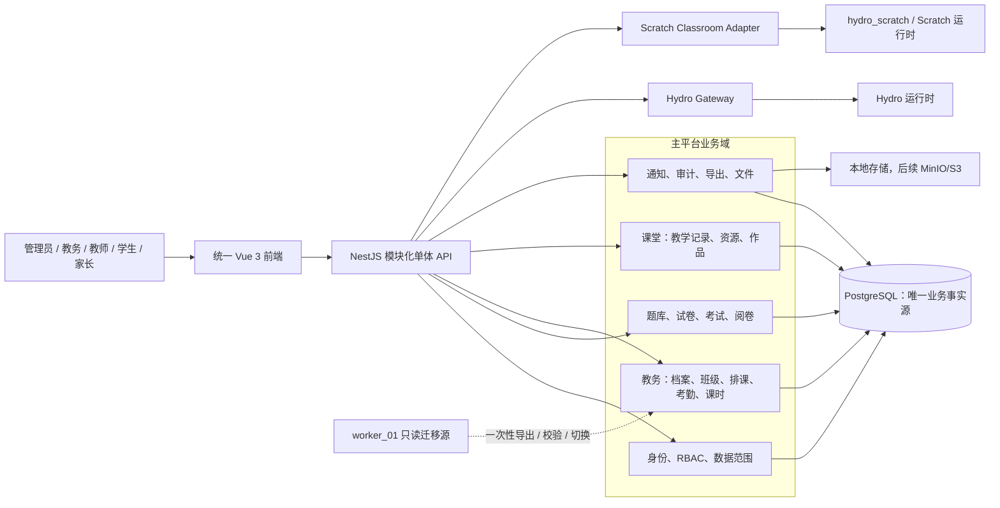
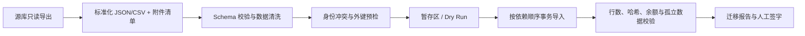

# 教务系统融入可行性与技术方案

> 调研日期：2026-07-15
> 目标平台分支：`codex/p1-architecture-refactor`
> 目标平台提交：`f2bb366315a9aa61a79849abbd1f75023b6a074b`
> GitHub 账号：[`moran-007`](https://github.com/moran-007)

## 1. 最终结论

**可行，建议融入。**

但“融入”应定义为：把 [`worker_01`](https://github.com/moran-007/worker_01) 中已经验证的教务业务能力和历史数据迁入当前 NestJS + Prisma + PostgreSQL 平台，形成统一账号、权限、班级、课程、文件、通知和审计；**不建议直接合并 Python/Flask 源码，不建议让 Flask 应用成为长期并行的第二套教务系统，也不建议双写两套数据库。**

推荐目标形态是“类型化模块单体 + 独立专业运行时”：

- 当前 `online-exam-assessment-platform` 作为唯一产品主入口和业务数据源。
- 教务管理以新领域模块并入 NestJS 模块化单体。
- 教师、学生、家长继续使用同一 Vue 应用和统一认证。
- Hydro 与 Scratch 专用运行时保留独立，通过明确的 Gateway、事件或任务适配器接入。
- `worker_01` 仅作为迁移源和验收参考，切换后只读留档；`class_worker` 作为旧前身归档。

综合判断：

| 维度 | 结论 | 说明 |
| --- | --- | --- |
| 业务互补性 | 高 | 现平台强于题库/考试/判题，worker 强于排课/考勤/课消/课堂记录 |
| 数据模型可迁移性 | 高 | 用户、课程、班级已有承载点；新增教务模型即可完整表达 |
| 前端融合可行性 | 高 | 两边均为 Vue 3 + Vue Router + Element Plus，交互模式可重构复用 |
| 后端代码直接复用 | 低 | Flask 单文件巨型应用、Raw SQL、SQLite/MySQL 兼容层与 NestJS/Prisma 不兼容 |
| 历史数据迁移 | 中高 | 表结构清晰，但身份冲突、密码哈希、附件路径和课时余额需专项处理 |
| 运维合并收益 | 高 | 可消除第二套登录、部署、备份、权限和数据口径 |
| 总体建议 | **实施** | 采用分阶段绞杀迁移，不做永久双轨 |

## 2. 调研范围与证据

### 2.1 GitHub 账户扫描

本次通过已认证的 GitHub 账号实时扫描到 24 个仓库，其中 10 个公开、14 个私有。与教务融合直接相关的仓库如下：

| 仓库 | 可见性 | 主要语言 | 最近推送（扫描时） | 定位 |
| --- | --- | --- | --- | --- |
| [`online-exam-assessment-platform`](https://github.com/moran-007/online-exam-assessment-platform) | 公开 | TypeScript | 2026-07-15 | 当前考试/题库/判题主平台 |
| [`worker_01`](https://github.com/moran-007/worker_01) | 公开 | Python | 2026-06-06 | 当前最完整教务能力源，首选迁移对象 |
| [`class_worker`](https://github.com/moran-007/class_worker) | 公开 | Python | 2026-06-05 | worker_01 的较早前身，不作为独立目标 |
| [`hydro_scratch`](https://github.com/moran-007/hydro_scratch) | 公开 | JavaScript | 2026-06-17 | Scratch/Hydro 专用运行时，适合作为外部适配能力 |
| [`hydro_points`](https://github.com/moran-007/hydro_points) | 公开 | TypeScript | 2026-06-04 | Hydro 积分扩展，后续可按插件接口评估 |
| [`hydro-objrand`](https://github.com/moran-007/hydro-objrand) | 私有 | TypeScript | 2026-06-28 | Hydro 专项能力，不纳入本期教务核心迁移 |

`worker_01` 当前远端主分支提交为 `0ec143b644c5f873b9c7ff68fa3ea0da5242f96c`；本次分析使用的本地副本与该提交一致。`class_worker` 当前提交为 `751642de7ca9f71812e852b5f9f5688f5d9a893b`。

### 2.2 当前主平台

当前平台已有：

- 统一 User、动态 Role/Permission、JWT 会话；
- Course、ClassGroup、ClassStudent、ClassTeacher；
- 题库、试卷、考试、学生答题、阅卷、统计；
- Hydro 账号、题目绑定、提交与判题回写；
- 文件资源、导出任务、通知和审计；
- Swagger/OpenAPI、Orval 类型化前端客户端；
- Vue feature 目录、路由懒加载和重型依赖分包。

Prisma Schema 当前有 49 个 model、25 个 enum；后端有 23 个模块目录、20 个 Controller。`UserType` 已包含 `SUPER_ADMIN`、`ADMIN`、`TEACHER`、`ASSISTANT`、`STUDENT`、`PARENT`，因此教务角色可以在现有 RBAC 上扩展，不需要第二套身份体系。

现有 ClassGroup 只表达课程、班级和师生关系，尚不能完整表达：

- 学生/教师扩展档案；
- 家长与学生关系；
- 固定上课规则和具体课次；
- 点名、请假、缺勤、补课；
- 购买/赠送/扣减/退回课时台账；
- 教学目标、课堂表现、作业和下次计划；
- 课堂资源、Scratch 模板/作品/批阅。

### 2.3 worker_01

`worker_01` 使用 Flask 3.1、Python、Raw SQL、SQLite 默认数据库并兼容 MySQL；前端使用 Vue 3.5、Vue Router、Element Plus 和 Vite，因而页面交互经验可复用，但后端实现不适合直接合并。

代码特征：

- `app/app.py` 约 6,717 行，包含约 130 个 Flask 路由；
- `app/database.py` 约 1,482 行；
- `app/permissions.py` 约 523 行；
- 约 25 张业务表、20 个 Vue View；
- 无常规自动化测试文件和 GitHub Actions；有流程校验脚本，但不足以作为迁移回归基线；
- 数据库层同时兼容 SQLite/MySQL，存在大量方言转换和 Raw SQL；
- 默认配置中出现开发用数据库密码和 `dev-secret-key-change-me`，只能作为本地默认，不能原样进入生产；
- 仓库未声明许可证，代码跨仓迁移前应由仓库所有者明确内部使用/授权边界。

`worker_01` 已覆盖：

- 学生、教师、班级、课程预设、课型；
- 固定时段和批量生成课次；
- 点名、课时扣减、请假/缺勤等状态；
- 教学内容、学习目标、课堂表现、作业、下次计划；
- 统计、导出、操作日志和备份；
- 动态权限以及校长、教务、前台、教师、学生、家长角色；
- 教师备课资源、Scratch 模板、学生作品、提交和教师批阅；
- 外部账号绑定和 Scratch/OJ 扩展钩子。

仓库内较早的“功能完成情况清单”与当前代码/P0–P2 文档存在时间差，例如旧文档把学生/家长门户标为未完成，而当前路由和页面已经存在这些功能。本报告以当前提交的代码和最新阶段文档为准，旧清单只作历史参考。

### 2.4 class_worker

`class_worker` 与 `worker_01` 的技术栈和早期教务模型高度重合；`worker_01` README 和代码演进表明它在前者基础上继续增加了学生/家长门户、备课、Scratch 作品和权限能力。

因此：

- 不对两个仓库分别迁移；
- 以 `worker_01` 当前主分支为唯一功能基线；
- 仅在发现 worker 缺失历史数据迁移逻辑时回看 `class_worker`；
- 完成切换后两个仓库均归档，`worker_01` 保留只读迁移标签，`class_worker` 标明 superseded。

## 3. 为什么不直接合并代码

直接把 Flask 作为子目录或服务永久保留，看似速度快，实际会形成以下长期成本：

1. 两套认证、用户、角色和会话，权限结果难以保证一致。
2. PostgreSQL 与 SQLite/MySQL 双数据源，需要同步班级、学生、课程和教师。
3. Flask Raw SQL 与 Prisma migration 形成两套数据库演进方式。
4. 两套前端路由、错误处理、API 客户端和部署流水线。
5. 考勤、课消、考试和学生门户需要跨系统事务，失败后很难恢复。
6. `app.py` 的巨型路由结构会把当前平台刚完成的 P1 架构问题重新引入。
7. worker 缺乏常规测试和 CI，无法靠原代码直接证明迁移后行为一致。

可以临时运行 Flask 作为**只读迁移源**或对照环境，但不得成为最终写入路径。

## 4. 目标架构



架构原则：

- PostgreSQL 是用户、班级、课次、考勤、课时和作品元数据的唯一事实源。
- 外部运行时只保存其执行所需数据；主平台保存绑定关系和业务状态。
- 写事务不跨 HTTP：先提交本地事务和 outbox，再异步调用外部运行时。
- Controller 依赖用例；写用例持有事务；不创建新的全局教务 Facade。
- 现有对外 API 保持兼容；新增教务 API 使用独立 tag 和权限。

## 5. 领域边界与模块设计

### 5.1 复用现有模块

| 现有能力 | 复用方式 |
| --- | --- |
| User / Auth | 所有角色使用同一账号、密码策略和 Refresh Token |
| Role / Permission | 增加教务权限，不创建固定角色硬编码判断 |
| Course | 作为课程主数据；教务预设/课次引用 Course |
| ClassGroup | 作为班级主实体，扩展排课关系而不是另建第二张 classes 主表 |
| ClassStudent / ClassTeacher | 继续作为成员关系，增加状态和离班信息 |
| FileAsset | 课堂资源、Scratch 模板和作品统一引用 |
| Notification | 课次变更、请假结果、作业和批阅通知 |
| AuditLog | 教务关键操作进入统一审计 |
| HydroAccount / ExternalOjPlatform | 继续承载 Hydro 账号和平台绑定 |

### 5.2 新增模块

建议按领域而不是按数据库表建立模块：

```text
src/modules/
  student-profiles/
  teacher-profiles/
  parent-relations/
  lesson-catalog/
  lesson-scheduling/
  attendance/
  lesson-hours/
  teaching-records/
  classroom-assets/
  scratch-classroom/
  legacy-import/
```

职责边界：

- `student-profiles`：学员业务档案，不负责账号密码和角色。
- `teacher-profiles`：教师业务档案、任课状态，不负责授权目录。
- `parent-relations`：家长与学生关系及可见范围。
- `lesson-catalog`：课型、课程单元/预设和标准课时。
- `lesson-scheduling`：固定规则、具体课次、调课、停课和补课。
- `attendance`：点名状态、签到信息、批量确认和更正。
- `lesson-hours`：购买、赠送、扣减、退回、调整的不可变台账。
- `teaching-records`：教学内容、目标、课堂表现、作业和下次计划。
- `classroom-assets`：教师备课资源和课次资源关联。
- `scratch-classroom`：模板、任务、作品、提交、批阅和外部判定映射。
- `legacy-import`：只在迁移期存在，负责 worker 数据解析、校验、映射和报告。

## 6. 建议数据模型

字段名称可在实施时按现有命名规范调整，但业务约束不能省略。

### 6.1 身份档案与关系

#### StudentProfile

| 字段 | 说明 |
| --- | --- |
| `id` | UUID 主键 |
| `userId` | 唯一关联 User |
| `studentNo` | 可选学号/内部编号，组织内唯一 |
| `gender`、`birthDate` | 档案字段，按最小必要原则保存 |
| `schoolName` | 原就读学校 |
| `contactPhone` | 学员联系号码，可与登录账号不同 |
| `status` | ACTIVE/PAUSED/GRADUATED/ARCHIVED |
| `remark` | 管理备注，限制权限和日志输出 |
| `legacySourceId` | 迁移期可由统一映射表代替 |

不把 `purchasedHours`、`giftHours` 直接作为余额事实源；余额从课时台账计算，可保留缓存列但必须可重建。

#### TeacherProfile

包含 `userId`、教师编号、在职状态、简介/擅长方向等业务字段。教师可以没有登录账号的需求应在产品层明确；若允许临时教师，也建议仍创建受限 User，而不是第二套姓名外键。

#### ParentStudent

| 字段 | 约束 |
| --- | --- |
| `parentId` | 指向 User，必须具有 PARENT 角色或权限 |
| `studentId` | 指向 StudentProfile/User |
| `relationship` | 父亲/母亲/监护人/其他 |
| `isPrimary` | 是否主要联系人 |
| `canViewLearning`、`canReceiveNotice` | 精细授权 |

`(parentId, studentId)` 唯一。家长数据范围只能从该关系推导，不能由前端传入 studentId 后直接放行。

### 6.2 班级成员扩展

现有 `ClassStudent` 建议增加：

- `status`: ACTIVE/PAUSED/LEFT/COMPLETED；
- `joinedAt`、`leftAt`；
- 可选 `enrollmentSource`；
- 唯一约束和历史保留策略。

现有 `ClassTeacher` 建议增加：

- `role`: HEAD/ASSISTANT/SUBSTITUTE；
- `status`、`leftAt`；
- 教师数据范围由有效关系和具体课次任课教师共同决定。

删除成员默认做状态变更，不物理删除已关联考勤、试卷、作品或审计的数据。

### 6.3 课程目录与排课

#### LessonType

定义课型名称、默认时长、默认扣减课时、颜色/显示信息和状态。

#### CourseUnitTemplate

承载 worker 的 course preset：课程、序号、主题、教学目标、默认内容、默认作业、资源引用。它是备课模板，不是已发生的具体课次。

#### ClassScheduleRule

保存班级固定排课规则：星期、当地开始时间、时长、生效区间、任课教师、课型和时区。规则只负责生成 `LessonSession`；修改规则不应静默改写已完成课次。

#### LessonSession

| 字段 | 说明 |
| --- | --- |
| `id` | UUID |
| `classId`、`courseId` | 班级和课程 |
| `teacherId` | 当次任课教师 |
| `lessonTypeId`、`unitTemplateId` | 可选课型/预设 |
| `startsAt`、`endsAt` | 带时区语义的具体时间点，数据库使用 UTC |
| `classroom` | 线下教室或线上入口 |
| `topic` | 当次主题，可覆盖模板 |
| `status` | SCHEDULED/IN_PROGRESS/COMPLETED/CANCELLED |
| `sourceRuleId` | 来源规则，可空 |
| `version` | 乐观并发版本 |

重复生成课次需要幂等键，例如 `(sourceRuleId, startsAt)` 唯一。调课应记录原时间和变更审计；已完成课次不能直接取消，需使用更正流程。

### 6.4 考勤与课时台账

#### AttendanceRecord

| 字段 | 说明 |
| --- | --- |
| `sessionId`、`studentId` | 组合唯一 |
| `status` | PRESENT/LATE/LEAVE/ABSENT/MAKEUP/CANCELLED |
| `checkedInAt` | 签到时间 |
| `deductUnits` | 本次应扣课时快照 |
| `operatorId` | 最后操作人 |
| `remark` | 更正说明 |
| `version` | 并发控制 |

考勤确认与课时扣减必须在同一数据库事务中完成。重复提交同一状态不得重复扣费；状态从“扣费”改为“不扣费”时自动产生反向台账，不删除历史记录。

#### LessonHourLedger

不可变流水字段：

- `studentId`
- `type`: PURCHASE/GIFT/DEDUCT/REFUND/ADJUSTMENT/TRANSFER
- `amount`: 正数增加、负数减少
- `sourceType`、`sourceId`: 关联订单、考勤或人工调整
- `occurredAt`、`operatorId`、`reason`
- `idempotencyKey`: 唯一

余额等于流水合计。若为查询性能维护 `LessonHourBalance`，它必须在同一事务更新，并提供全量重算和对账任务。任何人工修改都通过 ADJUSTMENT 流水，不能直接改余额。

### 6.5 教学记录与资源

#### LessonRecord

与 LessonSession 一对一或按版本保存，字段包括：

- `teachingContent`
- `learningGoal`
- `classPerformance`
- `homework`
- `nextPlan`
- `submittedBy`、`submittedAt`
- `version`、`status`

如需多人协作，保存草稿与发布版本；学生/家长只能看到已发布且被授权的字段。

#### LessonAsset

连接 LessonSession/CourseUnitTemplate 与现有 FileAsset，记录用途、排序和可见范围。二进制文件仍由统一 FileAsset/ObjectStorage 管理，教务表不保存本机绝对路径。

### 6.6 Scratch 课堂

建议模型：

- `ScratchTemplate`：标题、版本、源 FileAsset、缩略图、说明；
- `LessonScratchAssignment`：课次、模板、要求、截止时间；
- `ScratchWork`：学生、任务、当前版本、状态；
- `ScratchWorkVersion`：不可变作品文件/元数据；
- `ScratchReview`：教师评价、等级/分数、批阅状态；
- `ScratchJudgeRun`：外部运行时任务 id、状态、结果和错误摘要。

作品源文件、缩略图和执行产物走统一文件存储；外部 Scratch/Hydro 只负责解析、运行、判定或展示，不成为学生身份和课次关系的事实源。

### 6.7 迁移映射

新增 `LegacyIdMapping`：

| 字段 | 说明 |
| --- | --- |
| `sourceSystem` | 固定为 `worker_01` |
| `entityType` | students/classes/lessons/... |
| `sourceId` | 原主键字符串 |
| `targetId` | 新 UUID |
| `sourceHash` | 原记录标准化哈希 |
| `migrationRunId` | 所属迁移批次 |

`(sourceSystem, entityType, sourceId)` 唯一，使迁移可重跑、可核对、可追踪。

## 7. 数据映射方案

| worker_01 | 目标平台 | 处理规则 |
| --- | --- | --- |
| `users` | `User` + Role | 按 username/phone/email 去重；不直接复制密码哈希 |
| `students` | `User` + `StudentProfile` | 无登录账号时生成受限账号或待激活身份；课时余额转为期初台账 |
| `teachers` | `User` + `TeacherProfile` | 先匹配现有教师账号，再创建档案 |
| `classes` | `ClassGroup` | course_name 映射/创建 Course；教师用关系表表达 |
| `class_students` | `ClassStudent` | 保留加入、离开和状态；检查孤立学生 |
| `lesson_types` | `LessonType` | 名称标准化后去重 |
| `course_presets` | `CourseUnitTemplate` | 关联 Course，保留顺序和默认内容 |
| `lessons` | `LessonSession` | 将源时区 Asia/Shanghai 转为 UTC；生成幂等键 |
| `lesson_details` | `LessonRecord` | 与课次关联；孤立详情进入异常报告 |
| `attendance` | `AttendanceRecord` + `LessonHourLedger` | 考勤唯一；历史扣减转为不可变流水 |
| `student_points_ledger` | `LessonHourLedger` 或独立积分台账 | 先确认其语义是课时还是积分，禁止混表 |
| `uploaded_assets` | `FileAsset` | 复制文件、SHA-256 去重、校验 size/mime |
| `lesson_assets` | `LessonAsset` | 使用新的 FileAsset id |
| `external_account_bindings` | 现有 Hydro/外部平台账号模型 | 仅迁移支持的平台；密码先加密，不迁移明文 |
| `scratch_material_categories` | Scratch 分类/Tag | 名称去重并保留层级 |
| `scratch_materials` | `ScratchTemplate`/FileAsset | 按实际用途区分模板与普通资源 |
| `scratch_templates` | `ScratchTemplate` | 生成版本 1 |
| `lesson_scratch_templates` | `LessonScratchAssignment` | 关联 LessonSession 和模板 |
| `scratch_works` | `ScratchWork` + Version | 保留提交状态、文件和时间 |
| `scratch_judge_runs` | `ScratchJudgeRun` | 只保留可审计元数据，不依赖原任务继续运行 |
| `operation_logs` | `AuditLog` | 规范 action/resource/actor；无法映射的 actor 保留原始标识 |
| `role_definitions` 等 | Role/Permission | 不整表覆盖；按映射表合并到现有权限体系 |
| `system_migrations`、备份元数据 | 不迁移 | 只用于证明源库版本 |

### 7.1 密码处理

worker 使用的密码哈希机制与当前平台不应假定兼容，且直接复制会保留旧安全参数。推荐：

1. 已存在的账号按确定性规则匹配，不覆盖当前密码。
2. 新迁入账号创建为 `RESET_REQUIRED`/待激活状态。
3. 通过管理员发放一次性激活链接或临时凭据，首次登录强制设新密码。
4. 迁移报告只记录账号状态，不导出密码、哈希或临时凭据。

### 7.2 账号冲突规则

按以下顺序匹配，任何不唯一都进入人工冲突队列：

1. 明确的人工映射；
2. 已验证手机号；
3. 已验证邮箱；
4. 完全一致且唯一的 username；
5. 姓名只作为辅助证据，绝不能单独自动合并。

迁移工具必须输出：自动匹配、新建、人工处理、跳过和失败五类清单。

### 7.3 课时余额迁移

若源库有完整流水，逐条转换并校验总和；若只有购买/赠送/剩余汇总，则：

- 生成 `OPENING_PURCHASE`、`OPENING_GIFT` 或一个明确的 `OPENING_BALANCE` 台账；
- 在 metadata 保存源字段和迁移批次；
- 迁移前后逐学生对账；
- 不伪造历史考勤扣减流水。

## 8. 权限与数据范围

### 8.1 角色映射

worker 角色不应硬编码到 `UserType`，建议创建/更新动态角色：

| worker 角色 | 建议目标角色 |
| --- | --- |
| `super_admin` | 现有超级管理员 |
| `principal` | 校长/运营负责人角色，组合统计、教务和用户只读/管理权限 |
| `academic_manager` | 教务主管 |
| `admin_office` | 教务前台 |
| `teacher` | 现有教师角色 + 教务教师权限 |
| `student` | 现有学生角色 |
| `parent` | 家长角色 |
| `admin/staff/read_only` | 按实际权限组合迁移，不按名称猜测 |

### 8.2 建议新增权限

```text
student_profile:read / create / update / archive
teacher_profile:read / update
class_roster:read / manage
lesson_catalog:read / manage
lesson_schedule:read / create / update / cancel
attendance:read / check / correct
lesson_hours:read / purchase / gift / adjust / refund
teaching_record:read / edit / publish
classroom_asset:read / manage
scratch_assignment:read / manage / submit / review
parent_portal:view
academic_statistics:view / export
legacy_import:execute / view_report
```

高风险权限如课时调整、历史考勤更正、迁移执行和全量导出必须单独授权并写审计。

### 8.3 数据范围

- 教师：有效 ClassTeacher 关系或 LessonSession.teacherId 范围内的数据。
- 学生：自己的课次、考勤、课时、教学记录公开部分和作品。
- 家长：仅 ParentStudent 关联学生，且受关系权限字段限制。
- 教务：按组织/校区范围；当前单组织可先全局，若未来多校区再增加 Organization/Campus。
- 超级管理员：全局，但敏感导出和课时调整仍写审计。

不要在本期提前构建复杂多租户。只有存在真实多机构隔离需求时再引入 Organization/Tenant，并通过数据库外键和查询策略全面实现，不能只在前端增加筛选器。

## 9. API 与前端融合

### 9.1 API 示例

保持 `/api/v1` 前缀，按 tag 生成 Orval 客户端：

```text
GET    /api/v1/student-profiles
POST   /api/v1/student-profiles
GET    /api/v1/classes/:classId/roster
POST   /api/v1/classes/:classId/students

GET    /api/v1/lesson-sessions
POST   /api/v1/lesson-sessions
PATCH  /api/v1/lesson-sessions/:id/reschedule
POST   /api/v1/lesson-sessions/:id/cancel

GET    /api/v1/lesson-sessions/:id/attendance
PUT    /api/v1/lesson-sessions/:id/attendance
POST   /api/v1/attendance/:id/correct

GET    /api/v1/students/:studentId/lesson-hours
POST   /api/v1/students/:studentId/lesson-hours/adjustments

GET    /api/v1/lesson-sessions/:id/record
PUT    /api/v1/lesson-sessions/:id/record
POST   /api/v1/lesson-sessions/:id/record/publish

POST   /api/v1/scratch-assignments
POST   /api/v1/scratch-assignments/:id/submissions
POST   /api/v1/scratch-works/:id/reviews
```

要求：

- 所有列表使用统一 `PageResult<T>`；
- 写操作支持 `Idempotency-Key` 或业务幂等键；
- 并发更新使用 `version`/If-Match；
- 批量考勤返回逐项结果，但事务策略必须明确；
- Controller 声明显式响应 DTO，生成客户端不使用宽泛记录类型；
- 前端 feature API 不拼 URL，只调用生成客户端和 typed adapter。

### 9.2 前端信息架构

建议新增：

```text
frontend/src/features/academic/
  api/
  models/
  components/
  composables/

frontend/src/features/classroom/
frontend/src/features/attendance/
frontend/src/features/lesson-hours/
frontend/src/features/scratch-classroom/
```

路由建议：

```text
/academic/students
/academic/teachers
/academic/classes
/academic/schedule
/academic/attendance
/academic/lesson-hours
/classroom/lessons/:id
/classroom/scratch
/student/lessons
/parent/children
```

保留现有考试/题库 URL 和权限 meta。新路由全部懒加载，日历、富文本/Scratch 预览等重型依赖独立分包。学生/家长入口共享领域组件，但页面编排和权限必须分离，不能只靠隐藏按钮实现安全。

### 9.3 页面迁移原则

worker 页面可以作为交互和字段参考，但不直接复制其 API 调用和状态代码：

- 列表/表单重建为 TypeScript feature；
- 使用现有布局、会话、错误处理和权限组件；
- 日期统一由 UTC API + Asia/Shanghai 展示层转换；
- 表单枚举来自生成客户端或领域映射；
- 家长/学生门户用真实低权限账号做 Playwright 验证。

## 10. Scratch 与 Hydro 的融合方式

### 10.1 保留独立运行时的原因

Scratch 项目解析、缩略图、运行/判定和 Hydro 插件生命周期与普通 NestJS CRUD 差异较大。把 `hydro_scratch` 直接搬进主进程会增加依赖冲突、资源隔离和升级成本。

因此保留：

- NestJS 保存课堂任务、作品元数据、权限和业务状态；
- 文件由统一存储管理；
- `ScratchRuntimeGateway` 负责提交解析/判定请求；
- `ScratchJudgeRun` 保存异步状态；
- 回调必须签名、幂等并校验任务归属；
- 不在数据库事务中同步等待外部判定。

### 10.2 建议接口

```ts
interface ScratchRuntimeGateway {
  inspectAsset(assetId: string): Promise<ScratchProjectMetadata>;
  createPreview(assetId: string): Promise<RuntimeJobRef>;
  judge(input: ScratchJudgeInput): Promise<RuntimeJobRef>;
  getJob(jobId: string): Promise<RuntimeJobStatus>;
}
```

Hydro 已有 Gateway/Parser/Polling Worker 边界，可复用其阻断、重试、日志脱敏、轮询终止和判题回写经验，但不要让 Scratch 课堂直接依赖 Hydro 内部 Service。

## 11. 迁移实施方案

采用“绞杀式单向迁移”：新功能先在主平台实现和验证，worker 保持只读对照，最后一次性冻结写入并切换。禁止永久双写。

### 阶段 0：决策与安全基线（约 1 周）

- 确认 worker 实际生产数据库类型、版本、数据量、附件目录和运行地址。
- 冻结源 Schema 版本并做可恢复备份；记录数据库和附件校验和。
- 明确仓库代码授权和内部使用范围。
- 清理/轮换 worker 中曾使用的默认或弱 Secret。
- 明确账号冲突、课时余额、删除/归档和历史数据保留规则。
- 产出字段级数据字典和脱敏样例数据集。

退出条件：能从备份完整恢复 worker；所有源表行数、附件数和总大小有基线。

### 阶段 1：身份档案与班级花名册（约 1–2 周）

- 实现 StudentProfile、TeacherProfile、ParentStudent。
- 扩展 ClassStudent/ClassTeacher 生命周期字段。
- 增加教务角色、权限和数据范围测试。
- 实现只读迁移预检和身份冲突报告。
- 前端上线学生、教师、班级管理的新页面。

退出条件：老师只能看到授权班级，学生/家长只看到自身关系；worker 基础档案在演练环境全部可映射。

### 阶段 2：排课、考勤和课时台账（约 2–3 周）

- 实现 LessonType、CourseUnitTemplate、ClassScheduleRule、LessonSession。
- 实现 AttendanceRecord、LessonHourLedger 和事务规则。
- 完成调课、停课、补课、考勤更正和反向课消。
- 实现课次日历、点名和课时流水页面。
- 增加并发、幂等、时区和余额对账测试。

退出条件：重复点名不重复扣费；任何余额可从台账重建；批量生成课次不重复。

### 阶段 3：教学记录、资源、学生/家长门户（约 2 周）

- 实现 LessonRecord、LessonAsset。
- 接入 Notification 和 AuditLog。
- 迁移教学详情和资源附件。
- 上线学生课次详情、家长子女视图和通知。
- 用真实低权限账号验证字段可见性。

退出条件：未发布内容对学生/家长不可见；附件访问不可越权；历史课堂记录完整。

### 阶段 4：Scratch 课堂（约 2–3 周）

- 实现 ScratchTemplate、Assignment、Work、Review、JudgeRun。
- 对接 `hydro_scratch` 适配器，先在测试环境完成作品解析/预览/判定。
- 迁移模板、作品和批阅记录；附件按 SHA-256 去重。
- 增加外部任务超时、重复回调、失败重试和降级测试。

退出条件：外部运行时不可用时主平台数据不损坏；作品版本可追溯；回调幂等。

### 阶段 5：全量演练、切换和归档（约 1–2 周）

1. T-7 天：从最新备份做一次全量演练，输出差异报告。
2. T-3 天：解决身份冲突和附件失败；业务验收签字。
3. T-0：worker 进入维护模式，停止写入。
4. 导出最终增量，执行幂等导入、校验和自动化回归。
5. 切换入口到主平台，worker 保持只读。
6. 观察期内监控错误、考勤、课时和登录；触发阈值则回滚入口。
7. 观察期通过后关闭 worker 写服务，仓库打迁移标签并归档。

以上是工程量级估算，需在阶段 0 得到真实数据量、冲突数和附件规模后再校准。

## 12. 迁移工具设计

建议放入 `src/modules/legacy-import` 和独立 `scripts/legacy-worker-import`，不把源库 SQL 混入正式业务 Service。

流水线：



要求：

- 导出文件包含源版本、导出时间、时区、表行数和 SHA-256；
- 标准化格式有 JSON Schema 或 Zod 校验；
- 所有导入支持 dry-run 和 migrationRunId；
- 每条记录通过 LegacyIdMapping 幂等；
- 大表分批事务，单批失败不污染已确认批次；
- 附件先复制到临时区，校验后再绑定 FileAsset；
- 失败记录保留源 id、原因和可重试状态，不把敏感字段写入报告；
- 迁移工具只在受控运维环境运行，并需要 `legacy_import:execute` 权限/二次确认。

推荐导入顺序：

1. 角色/权限映射配置；
2. 用户、学生、教师、家长关系；
3. 课程、课型、预设；
4. 班级、师生关系；
5. 排课规则和具体课次；
6. 教学记录、考勤和期初/历史课时流水；
7. 文件资源和课次关联；
8. Scratch 模板、任务、作品、批阅和判定记录；
9. 审计日志和可选历史通知。

## 13. 一致性校验

每次演练和最终切换必须自动生成：

| 校验项 | 通过条件 |
| --- | --- |
| 实体行数 | 源有效记录数 = 迁入 + 明确跳过 + 明确失败 |
| 外键 | 无孤立班级成员、课次、考勤、教学详情、作品 |
| 身份 | 每个迁入档案恰好关联一个目标 User |
| 班级 | 有效学生/教师关系与源库一致 |
| 课次 | 日期、时间、教师、班级和状态一致；时区转换抽样通过 |
| 考勤 | `(session, student)` 唯一，状态分布与源库一致 |
| 课时 | 每名学生源余额与目标台账余额一致，差异为 0 或有人工签字 |
| 附件 | 文件数、总字节和 SHA-256 一致；不可读文件有明确清单 |
| 权限 | 教师/学生/家长越权测试全部拒绝 |
| Scratch | 模板、作品版本、批阅和外部任务引用可追溯 |

不允许以“页面大致能打开”代替数据一致性验收。

## 14. 回滚方案

### 14.1 切换前

- 主平台和 worker 分别做数据库/附件备份并验证恢复。
- worker 在切换窗口进入只读，避免回滚时出现双边新增数据。
- 记录主平台迁移前数据库点和 migrationRunId。

### 14.2 切换观察期

回滚只切换入口，不执行反向双写：

- 若身份、核心排课或课时校验失败，立即停止主平台教务写入；
- 删除/隔离本次 migrationRunId 导入的数据，或恢复主平台备份；
- worker 恢复入口前确认其只读期间没有遗漏写入；
- 修复后从新的源快照重新演练。

### 14.3 不可回滚边界

一旦正式关闭 worker 且主平台已产生新的教务写入，就不应再把 worker 恢复为事实源。此后问题通过主平台数据库恢复、事件补偿和业务更正处理。观察期长度应根据实际业务节奏覆盖至少一个完整上课/点名/课消周期。

## 15. 测试与验收

### 15.1 后端

- 档案创建/合并、账号冲突和首次激活；
- 班级加入、离班、教师替换和历史关系；
- 规则生成课次、跨日/节假日/夏令时边界（当前时区仍需正确处理）；
- 调课、停课、补课和并发更新；
- 考勤重复提交、更正、反向课消和余额重建；
- 家长关系和教师数据范围拒绝路径；
- 教学记录草稿/发布和附件访问；
- Scratch 外部运行时超时、重试、重复回调和错误降级；
- 迁移 dry-run、幂等重跑、部分失败和完整报告。

### 15.2 前端/浏览器

至少覆盖：

1. 超级管理员创建教务角色并授权。
2. 教务创建学生、班级、排课规则并批量生成课次。
3. 教师只看到自己的班级，完成点名和教学记录。
4. 重复点名不重复扣课时。
5. 学生查看自己的课次、作业和 Scratch 任务。
6. 家长只查看已绑定子女，不可替换 URL 访问其他学生。
7. 教师下发 Scratch 模板，学生保存/提交，教师批阅。
8. 源数据迁移后抽样记录与 worker 页面一致。

### 15.3 非功能验收

- 核心教务 API P95 有基线且不因数据量线性恶化。
- 一次班级批量点名在事务和内存预算内完成。
- 附件上传/下载不暴露本机路径，可校验完整性。
- 所有新增 API 进入 OpenAPI/Orval 差异检查。
- 新页面无 `@ts-nocheck`，路由懒加载，应用自有 chunk 不超预算。
- CI 运行 lint、架构检查、契约生成、vue-tsc、构建、包体积、Jest 和 Playwright。

## 16. 主要风险与缓解

| 风险 | 影响 | 缓解措施 |
| --- | --- | --- |
| 身份重复或误合并 | 数据越权、历史错挂 | 只用强标识自动匹配；姓名冲突人工确认 |
| 密码哈希不兼容 | 用户无法登录或安全降级 | 不复制密码，统一首次激活/重置 |
| 课时口径不清 | 财务/服务纠纷 | 阶段 0 明确口径；逐学生对账；不可变台账 |
| 源附件缺失/损坏 | 历史教学材料丢失 | 切换前全量哈希与可读性检查，失败清单签字 |
| worker 文档与代码漂移 | 功能漏迁 | 以当前路由、Schema、真实数据和最新 P2 文档为准 |
| 永久双写 | 难以恢复的一致性错误 | 只允许短期只读对照和单向切换 |
| 新模块重新变成巨型 Service | 维护性回退 | Controller 依赖用例、500 行预算和架构门禁 |
| 家长/教师数据越权 | 严重隐私问题 | 服务端数据范围、拒绝路径测试和审计 |
| 外部 Scratch/Hydro 不稳定 | 课堂任务失败 | 本地事务 + outbox、幂等任务、超时和降级 |
| worker 默认 Secret/无许可证 | 安全/治理风险 | 密钥轮换；由所有者明确代码使用和归档策略 |

## 17. 触发式基础设施演进

本期不需要因为并入教务就立即上微服务、Redis 和对象存储。使用明确触发条件：

| 能力 | 当前实现 | 切换触发条件 | 后续实现 |
| --- | --- | --- | --- |
| 后台任务 | PostgreSQL 状态 + 单实例 worker | 多实例竞争、跨重启强可靠、吞吐不足 | BullMQ + Redis |
| 文件 | 本地 ObjectStorage 实现 | 多实例共享、CDN、异地容灾 | MinIO/S3 |
| 应用架构 | NestJS 模块化单体 | 独立扩缩容/发布收益明显且边界成熟 | 只拆高自治外部运行时 |
| 组织隔离 | 单组织 + RBAC/数据范围 | 出现多个法律/运营主体和强隔离需求 | Organization/Tenant 全链路模型 |

Hydro/Scratch 运行时已经具备独立性的技术理由，可以保持进程级隔离；身份、班级、课次、考勤和课时不应拆出去。

## 18. 最终实施建议

1. 立即确认 `worker_01` 的真实生产数据源、附件和实际使用功能，制作只读快照。
2. 先完成当前平台的 CI 门禁、Hydro 凭据加密和用户 Service 边界准备。
3. 以“档案/班级 → 排课 → 考勤/课时 → 教学记录/门户 → Scratch”为固定顺序迁移。
4. 先实现新模型和测试，再导入历史数据；不要以迁移脚本反向决定长期 Schema。
5. `worker_01` 只作为迁移源和验收对照，切换后归档；`class_worker` 不再单独维护。
6. 保持主平台为唯一产品入口和数据事实源，保留 Hydro/Scratch 专用运行时的清晰适配边界。

按此方案实施，能够获得教务与考试数据贯通的主要收益：教师在同一班级和课程上下文内完成排课、点名、课堂记录、作业/作品、考试和统计；学生与家长使用一个入口查看学习过程；管理端避免重复维护账号、班级和数据权限。同时不会把旧 Flask 巨型应用的技术债带回当前平台。
