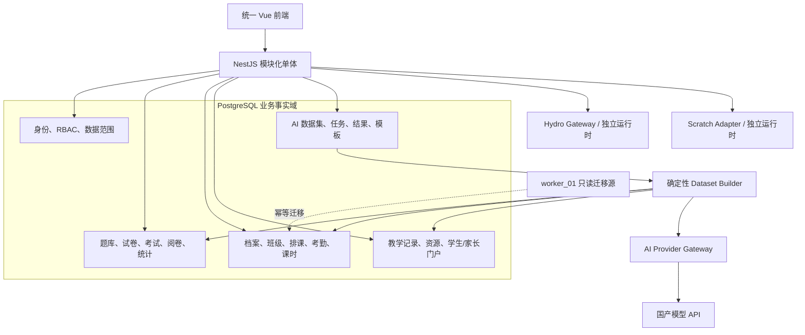

# AI 与教务融合完整目标及执行计划

> 编制日期：2026-07-16  
> 当前执行分支：codex/ai-edu-fusion
> 文档用途：作为下一阶段可直接执行、逐项验收的总目标  
> 本轮状态：持续执行中；阶段 2–8 已完成，阶段 9 的全量迁移、主入口切换、只读观察、旧服务关闭和代码归档已完成并通过全量质量门；仅剩已暴露旧 Key 的供应商侧撤销与换新确认

## 1. 可直接采用的总目标

在保留 NestJS、Prisma、PostgreSQL、Vue 3、Vite 模块化单体技术栈的前提下，将当前考试平台升级为统一的“考试 + 教务 + AI 学习分析”平台：

1. 继续收紧 API 契约、统计查询、前端页面和大导出等剩余工程问题。
2. 建立可复用、可审计、可控成本的 AI 业务底座。
3. 先基于现有考试数据交付考试总结和学生考试阶段总结。
4. 将 worker_01 的学生档案、教师档案、家长关系、排课、考勤、课时、教学记录和 Scratch 课堂能力迁入主平台。
5. 在教务核心数据稳定后，完成学生、班级、考试、课堂、家长和运营场景的完整 AI 布局。
6. 保持主平台为唯一账号入口和 PostgreSQL 唯一业务事实源；worker_01 切换后只读归档，Hydro/Scratch 保持独立专业运行时。

整个目标完成后，教师可以在同一课程和班级上下文中完成排课、点名、课时、教学记录、题库、考试、阅卷和 AI 分析；学生和家长可以查看经教师确认的学习总结；管理端可以获得可追踪、不可越权的教学和运营分析。

## 2. 关于先做教务还是先做 AI 的最终决策

### 2.1 结论

**不应该先把教务系统全部并入后才开始 AI，也不应该现在就把全部 AI 功能一次性铺开。**

推荐采用以下顺序：

1. **现在完成 AI 总体架构、权限、任务、结构化输出和评测设计。**
2. **先用现有考试数据上线“考试总结”。**
3. **实现“学生考试阶段总结”，但明确标识数据范围只包含考试、错题和知识点。**
4. **并入教务身份、排课、考勤、课时和教学记录。**
5. **教务数据稳定后，再升级为完整学生学习总结、班级总结、家长报告和课堂 AI 助手。**

这是一条“AI 底座先行、考试场景先验证、教务数据随后补齐、完整 AI 布局最后收口”的路线。

### 2.2 为什么不能完全等教务

- 当前平台已有完整的题库、试卷、考试、答题、阅卷、错题和知识点数据，足以验证 AI 总结的价值。
- 考试数据口径稳定、边界明确，容易核对模型是否编造事实。
- 如果完全等待教务迁移，AI 权限、任务、提示模板、结构化输出和评测会被无必要地推迟。
- 考试总结产生的真实使用反馈，可以反向修正后续学生和课堂总结设计。

### 2.3 为什么不能现在完成全部 AI 功能

- 综合学生画像需要出勤、课次、课堂表现、作业和家长关系，目前这些数据尚未进入主平台。
- 如果现在提前固化完整学生总结 DTO、页面和提示模板，教务模型落地后会发生第二次大改。
- 家长报告、缺勤风险、课时提醒和课堂助手都依赖教务权限与数据范围。
- 在数据模型和统计口径不稳定时铺开 AI，容易形成重复查询、重复提示模板和无法解释的结果。

### 2.4 决策矩阵

| AI 能力 | 当前数据是否足够 | 是否依赖教务 | 推荐时机 |
| --- | --- | --- | --- |
| 单场考试总结 | 足够 | 否 | 立即实施 |
| 班级考试分析 | 足够 | 否 | 与考试总结一起 |
| 学生考试阶段总结 | 基本足够 | 部分 | 考试总结后实施 |
| 错题与知识点学习建议 | 足够 | 否 | 学生总结第一版 |
| 综合学生学习报告 | 不完整 | 是 | 教务核心数据稳定后 |
| 家长学习周报/月报 | 不完整 | 是 | 家长关系和教学记录上线后 |
| 出勤风险提醒 | 不完整 | 是 | 考勤稳定后 |
| 课时异常说明 | 不完整 | 是 | 课时台账稳定后 |
| 课堂记录整理助手 | 不完整 | 是 | LessonRecord 上线后 |
| Scratch 作品过程总结 | 不完整 | 是 | Scratch 课堂接入后 |
| 主观题辅助阅卷 | 数据具备但高风险 | 否 | 后期只做建议，不自动写分 |
| AI 自动排课/自动扣课时 | 不允许 | 是 | 不实施自动写入 |

## 3. 最终产品范围

### 3.1 必须交付

#### 工程基础

- 新增 AI 和教务接口使用明确响应 DTO。
- 统计查询成为 AI 和页面共享的唯一确定性口径。
- 剩余大型页面按 feature/composable/component 拆分。
- 大导出使用分批查询和流式写入。
- CI、OpenAPI、Orval、vue-tsc、Jest、Playwright 和迁移检查持续有效。

#### AI

- AI 配置、模型能力注册、任务、提示模板和结果版本。
- 考试总结。
- 学生考试阶段总结。
- 教师审核、编辑、发布和撤回。
- 学生查看本人已发布总结。
- 教务融合后的综合学生总结、班级总结和家长报告。
- evidenceRef 事实引用、结构化输出、本地 Schema 校验。
- Token、成本、超时、错误、预算和审计指标。
- 脱敏黄金样本和自动评测。

#### 教务

- 学生档案、教师档案、家长关系。
- 班级成员生命周期。
- 课程单元/课型、固定排课规则和具体课次。
- 考勤、更正、补课和取消。
- 不可变课时台账和余额对账。
- 教学记录、课堂资源和学生/家长门户。
- Scratch 模板、任务、作品版本、批阅和外部判定。
- worker_01 历史数据和附件迁移。

### 3.2 明确不做

- 不拆分身份、课程、班级、考勤和课时为微服务。
- 不长期保留 Flask 作为第二套业务后端。
- 不保留 PostgreSQL 与 SQLite/MySQL 的永久双写。
- 不让 AI 自动修改分数、排名、考勤或课时。
- 不让 AI 自动发布给学生或家长。
- 不默认批量生成全校学生总结。
- 不把 API Key、密码、Token、完整答案正文和无关个人信息发送给模型。
- 不在单实例仍满足要求时提前引入 Redis/BullMQ/MinIO。

## 4. 目标架构

架构原则：

- PostgreSQL 保存所有业务事实和 AI 输入快照。
- AI 模型不直接访问数据库。
- Dataset Builder 只读取授权范围内的确定性统计。
- AI 输出先进入草稿，不直接成为业务事实。
- 外部运行时调用不放入本地数据库事务。
- 所有任务带 correlationId、inputHash 和版本信息。

## 5. AI 完整功能布局

### 5.1 第一层：确定性分析，不调用 AI

必须先由系统准确计算：

- 考试参考率、提交率、均分、中位数、最高/最低分和分布；
- 题目正确率、得分率、区分度提示和异常题目；
- 知识点掌握、错题次数、题型表现和成绩趋势；
- 学生出勤、迟到、请假、缺勤和作业完成；
- 课次完成和课时台账；
- Scratch 作品提交、版本和批阅状态。

这些能力即使 AI 不可用也必须正常展示和导出。

### 5.2 第二层：解释型 AI，优先实施

- 考试总结；
- 学生考试阶段总结；
- 班级共性问题总结；
- 错题与知识点学习建议；
- 教师教学行动建议。

这一层只能解释已有事实，风险最低，适合作为第一阶段。

### 5.3 第三层：教务融合后的学习过程 AI

- 综合学生学习总结；
- 学生周报/月报；
- 家长可读报告；
- 班级学习与出勤综合总结；
- 课堂记录整理和措辞优化；
- 作业/下次计划建议；
- Scratch 作品过程总结；
- 长期学习趋势和需关注事项。

所有结果必须经过教师或授权管理人员审核后才能发布。

### 5.4 第四层：高风险辅助能力，后期评估

- 主观题评分建议；
- 试题质量诊断；
- 题目改写和同类题草稿；
- 组卷建议；
- 排课冲突解释和方案建议。

限制：

- 评分只能作为教师参考，不能自动写入正式分数。
- 题目草稿不能自动发布到题库。
- 排课建议不能自动创建、取消或变更课次。
- 课时和考勤不允许 AI 写入。

## 6. AI 业务模型和接口目标

### 6.1 建议数据模型

#### AiSummaryTask

- id、type：EXAM/STUDENT/CLASS/PARENT_REPORT/LESSON
- subjectId
- scopeJson
- inputHash
- datasetVersion
- promptVersion
- schemaVersion
- providerConfigId、modelSnapshot
- status、attemptCount、correlationId
- inputTokens、outputTokens、estimatedCost
- createdBy、startedAt、finishedAt
- sanitizedError

#### AiSummary

- taskId、type、subjectId
- summaryJson
- sourceSnapshotJson
- evidenceIndexJson
- reviewStatus
- editedBy、reviewedBy
- publishedAt、revokedAt
- draftVersion

#### AiPromptTemplate

- code、summaryType、version
- systemPrompt
- outputSchema
- enabled
- reviewedBy、changeReason

#### AiProviderCapability

- provider、modelPattern
- supportsJsonObject
- supportsJsonSchema
- supportsStreaming
- supportsThinking
- maxContextTokens
- maxOutputTokens
- enabled

### 6.2 建议 API

| 方法 | 路径 | 用途 |
| --- | --- | --- |
| POST | /api/v1/ai-summaries/exams | 生成考试总结任务 |
| POST | /api/v1/ai-summaries/students | 生成学生总结任务 |
| POST | /api/v1/ai-summaries/classes | 生成班级总结任务 |
| POST | /api/v1/ai-summaries/parent-reports | 生成家长报告草稿 |
| GET | /api/v1/ai-summaries/tasks/:id | 查询任务状态 |
| GET | /api/v1/ai-summaries/:id | 获取总结 |
| PATCH | /api/v1/ai-summaries/:id | 编辑草稿 |
| POST | /api/v1/ai-summaries/:id/regenerate | 重新生成 |
| POST | /api/v1/ai-summaries/:id/publish | 发布 |
| POST | /api/v1/ai-summaries/:id/revoke | 撤回 |
| GET | /api/v1/exams/:id/ai-summaries | 考试总结历史 |
| GET | /api/v1/students/:id/ai-summaries | 学生总结历史 |
| GET | /api/v1/me/ai-summaries | 学生本人已发布总结 |

### 6.3 权限目标

- ai.summary.exam.generate
- ai.summary.student.generate
- ai.summary.class.generate
- ai.summary.parent-report.generate
- ai.summary.review
- ai.summary.publish
- ai.summary.revoke
- ai.summary.view-own
- ai.summary.view-class
- ai.prompt.manage
- ai.provider.manage

超级管理员管理模型和模板；教师只在任教班级与负责考试范围内生成；学生只能查看本人已发布内容；家长只能查看明确关联子女的已发布内容。

## 7. 分阶段执行计划

以下阶段是后续执行的固定主顺序。只有前一阶段满足退出条件，才进入依赖它的下一阶段。

## 阶段 0：目标冻结、备份和基线

预计：1–2 天。

### 目标

建立可回滚的执行起点，避免后续 AI 和教务变更与当前稳定版本混杂。

### 执行步骤

1. 提交并保存本次两份规划文档。
2. 从最新稳定提交创建新的执行前备份分支。
3. 创建 AI/教务融合实施分支。
4. 记录当前数据库 Schema、migration 数、OpenAPI、生成客户端和 bundle。
5. 运行完整质量门禁并保存结果。
6. 备份主数据库和上传/导出目录。
7. 核对当前 AI/Hydro 密文信封完整性。
8. 建立阶段验收记录目录。

### 交付物

- 基线提交和远端备份分支；
- 数据库与文件备份；
- 测试、覆盖率、包体积和 API 基线；
- 当前数据量报告。

### 退出条件

- 工作区干净；
- 本地与远端 SHA 一致；
- 完整门禁通过；
- 数据库和文件可恢复；
- 现有应用健康。

## 阶段 1：共享工程底座和教务源数据盘点

预计：1–2 周。

### 目标

同时完成 AI 的公共架构准备和教务迁移的数据事实确认，避免后续接口返工。

### 执行步骤

#### 工程

1. 将 statistics.service.ts 拆为明确查询用例。
2. 定义 ExamSummaryDataset、StudentSummaryDataset 和通用 EvidenceRef。
3. 新增 AI Summary 明确响应 DTO。
4. 禁止新增接口使用 ApiRecordDto。
5. 建立 AI summary task/result/template migration。
6. 建立 provider capability registry。
7. 新增 AI Token、耗时、错误和预算指标。

#### 教务盘点

8. 获取 worker_01 实际生产数据库只读副本。
9. 获取附件目录快照和 SHA-256 清单。
10. 冻结源 Schema 与版本。
11. 输出源表、字段、枚举和关联数据字典。
12. 确认实际使用的页面和流程。
13. 统计用户、班级、课次、考勤、课时、记录和附件数量。
14. 明确身份匹配、密码处理、课时口径和归档规则。
15. 确认仓库授权、旧 Secret 轮换和历史数据保留要求。

### 交付物

- 统计查询用例；
- AI 数据集、EvidenceRef 和结构化 Schema；
- AI 任务领域 migration；
- worker 数据字典；
- 数据质量和冲突报告；
- 附件清单与校验和。

### 退出条件

- AI 数据集不包含权限外数据；
- 每个指标有口径和来源；
- worker 主要表全部有迁移处置；
- 源数据库和附件可恢复；
- 课时余额和身份冲突规则已书面确认。

## 阶段 2：考试总结 MVP

预计：1–2 周。

### 目标

交付第一个可真实使用、可验证、可控成本的 AI 业务闭环。

### 执行步骤

1. 实现 ExamSummaryDatasetBuilder。
2. 复用考试统计查询计算确定性指标。
3. 实现考试和班级范围权限策略。
4. 建立考试总结 Prompt v1 和 JSON Schema。
5. 实现 inputHash 幂等和结果缓存。
6. 实现 AI Summary 任务处理。
7. 实现结构化结果校验和 evidenceRef 校验。
8. 实现考试结果页“AI 考试总结”入口。
9. 先展示确定性统计预览。
10. 实现草稿、编辑、重新生成、发布和撤回。
11. 学生端只显示已发布内容。
12. 建立至少 50 个脱敏考试黄金样本。
13. 增加权限、模型失败、超时、空响应、Schema 失败和事实一致性测试。

### 考试总结内容

- 参考人数和提交情况；
- 成绩分布和整体水平；
- 难题、易题和异常题目；
- 知识点共性薄弱项；
- 班级优势；
- 风险和需复核项；
- 下一轮教学行动建议。

### 退出条件

- 页面可以选择一场考试生成草稿；
- 所有具体数字都有 evidenceRef；
- 模型不可用时统计仍可查看；
- 教师审核后才能发布；
- 非授权教师、学生和未登录用户均被拒绝；
- 相同输入不重复计费；
- 真实模型只做最小受控验收；
- 单元、集成和浏览器测试全部通过。

### Gate A

只有当教师确认考试总结“事实正确、可操作、成本可接受”，才进入学生总结。

## 阶段 3：学生考试阶段总结

预计：1–2 周。

### 目标

基于现有考试、错题、知识点和编程判题数据生成学生阶段学习总结，不等待完整教务数据。

### 执行步骤

1. 实现 StudentSummaryDatasetBuilder v1。
2. 支持选择学生、课程、时间范围和考试。
3. 计算成绩趋势、题型表现、知识点掌握、错题和编程提交。
4. 在快照中增加 dataCoverage，明确当前只包含哪些数据。
5. 建立 Student Summary Prompt v1 和 Schema。
6. 实现教师范围权限。
7. 实现学生档案/班级详情的生成入口。
8. 实现学生端本人已发布总结。
9. 增加批量调用预估、限量和二次确认；首版不开放全校批量。
10. 建立高分、低分、缺考、少数据、无错题和异常趋势样本。

### 输出内容

- 学习概况；
- 成绩趋势；
- 优势知识点和题型；
- 薄弱知识点和常见错误；
- 编程题表现；
- 下一阶段练习建议；
- 数据覆盖声明和 AI 标识。

### 退出条件

- 教师只能选择授权学生；
- 学生只能查看本人已发布总结；
- 数据覆盖范围在页面明确显示；
- 不把“没有教务数据”解释为缺勤或课堂问题；
- 所有事实可追踪；
- 批量任务有明确预算。

### Gate B

学生总结 v1 不再扩展教务相关字段，直到阶段 4–6 的模型和权限稳定。

## 阶段 4：教务身份、档案和班级花名册

预计：1–2 周。

> 完成状态（2026-07-16）：已完成，Gate C 已通过。真实 `worker_01` 档案演练完成 177 条幂等映射；7 项测试数据身份冲突已逐项签字处置，旧密码读取数为 0。实施证据见 `docs/implementation/2026-07-16-stage-4-academic-identity.md`。

### 目标

建立后续排课、考勤、家长门户和完整 AI 学习画像的身份基础。

### 执行步骤

1. 新增 StudentProfile。
2. 新增 TeacherProfile。
3. 新增 ParentStudent。
4. 扩展 ClassStudent 生命周期。
5. 扩展 ClassTeacher 角色和生命周期。
6. 新增 LegacyIdMapping 和 MigrationRun。
7. 实现账号冲突预检。
8. 不复制旧密码，设计首次激活/重置流程。
9. 拆分 ClassView 并迁入 features/classes。
10. 上线学生档案、教师档案、家长关系和花名册页面。
11. 实现管理员、教务、教师、学生和家长的数据范围。
12. 执行第一轮档案迁移演练。

### 退出条件

- worker 基础档案全部可映射或进入人工冲突清单；
- 姓名相同不会自动误合并；
- 教师只能查看任教范围；
- 家长只能查看明确关联学生；
- 已有关联历史的成员不物理删除；
- 迁移可重跑且不产生重复记录。

### Gate C

身份冲突未清零或未签字时，不迁移课次、考勤和课时。

## 工程专项：题目与试卷导出文件修复

> 完成状态（2026-07-16）：已完成。统一响应拦截器不再包装二进制流；题库与试卷导出的 JSON、CSV、XLSX、DOCX、PDF、ZIP 均完成内容或文件签名验证，浏览器点击下载流程已通过。实施证据见 `docs/implementation/2026-07-16-export-file-repair.md`。

### 退出条件

- 二进制响应不会进入普通统一 JSON 包装；
- 下载响应的 MIME 类型、文件名后缀和实际内容一致；
- 题目与试卷迁移格式可解析，文档格式具有有效文件签名；
- 浏览器真实点击创建任务、下载和内容校验通过；
- 未授权下载仍被拒绝，并保留下载审计。

## 阶段 5：排课、课次、考勤和课时台账

> 完成状态（2026-07-16）：已完成。不可变课时台账、幂等排课、事务考勤、冲正更正、教学运营页面和全量重算均已上线。worker_01 已迁移 10 个课型、10 个课程单元、28 个课次、55 条考勤和 46 条期初余额；46 名学生逐一对账差异全部为 0，幂等复跑无重复。Gate D 已通过，实施证据见 `docs/implementation/2026-07-16-stage-5-academic-operations.md`。

预计：2–3 周。

### 目标

完成教务核心事务，并建立综合学生总结所需的稳定过程数据。

### 执行步骤

1. 新增 LessonType。
2. 新增 CourseUnitTemplate。
3. 新增 ClassScheduleRule。
4. 新增 LessonSession。
5. 新增 AttendanceRecord。
6. 新增 LessonHourLedger。
7. 可选增加可重建 LessonHourBalance。
8. 实现批量生成课次的幂等键。
9. 实现调课、停课、补课和取消。
10. 实现点名、批量确认和考勤更正。
11. 考勤确认与课时扣减放在同一事务。
12. 更正通过反向台账处理。
13. 上线课次日历、点名和课时流水页面。
14. 实现余额全量重算和对账任务。
15. 将 worker 当前余额迁移为 OPENING_BALANCE。
16. 逐学生对账并输出差异报告。

### 退出条件

- 重复生成课次不重复；
- 重复点名不重复扣课时；
- 考勤更正产生反向台账；
- 任意学生余额可从台账重建；
- 余额迁移差异为零或全部签字；
- 时区、并发和事务测试通过。

### Gate D

课时对账未通过时，不允许生产切换，也不允许 AI 对课时进行解释。

## 阶段 6：教学记录、资源和学生/家长门户

> 完成状态（2026-07-18）：已完成。教学记录草稿/提交/发布、不可变版本、公开/内部字段隔离、统一附件、通知审计和学生/家长学习门户已上线。worker_01 已迁移 5 条历史记录、10 个关联附件和 12 个课次载体，复跑无重复且对账差异为 0。学生、已关联家长和未关联家长浏览器范围验收通过，实施证据见 `docs/implementation/2026-07-18-stage-6-lesson-records-and-portal.md`。

预计：1–2 周。

### 目标

补齐完整学习过程数据，为综合学生总结和家长报告提供稳定来源。

### 执行步骤

1. 新增 LessonRecord。
2. 新增 LessonAsset。
3. 实现草稿、提交、发布和版本。
4. 字段区分教师内部内容与学生/家长可见内容。
5. 复用 FileAsset 和 ObjectStorage。
6. 接入 Notification 和 AuditLog。
7. 上线学生课次详情。
8. 上线家长子女课次、考试和已发布总结。
9. 迁移历史教学记录和附件。
10. 对附件执行存在性、大小、MIME 和 SHA-256 校验。

### 退出条件

- 未发布记录不可被学生/家长查看；
- 家长不可切换到未关联学生；
- 附件不可越权；
- 历史记录和附件数量一致；
- 教学记录变更有审计和版本。

## 阶段 7：完整 AI 布局

预计：2–3 周。

### 目标

在教务模型稳定后，把 AI 从考试总结升级为完整学习过程分析。

### 执行步骤

#### 综合学生总结

1. 将 StudentSummaryDataset 升级到 v2。
2. 增加出勤、课次、课堂目标、表现和作业数据。
3. 保留 v1/v2 数据集和模板版本可追溯。
4. 生成综合优势、风险和行动建议。
5. 对少数据学生降级为事实卡片，不强行生成结论。

#### 班级总结

6. 新增 ClassSummaryDatasetBuilder。
7. 汇总考试、知识点、出勤和作业。
8. 输出班级共性问题和下一周期教学建议。
9. 不输出无授权的学生隐私明细。

#### 家长报告

10. 新增 ParentReportDatasetBuilder。
11. 只包含允许家长查看的已发布内容。
12. 使用中性、清晰、不标签化学生的语言模板。
13. 必须由教师审核后发布。

#### 课堂助手

14. 支持教学记录整理和措辞优化。
15. 支持基于当前课次目标生成作业/下次计划草稿。
16. 草稿不能自动发布。

#### 运维与评测

17. 建立按功能、模型、模板的质量评分。
18. 建立 Token、成本和命中缓存看板。
19. 建立用户反馈和事实错误纠正流程。
20. 建立模型切换回归评测。

#### 测评与教务融合看板

21. 将确定性教务指标接入现有看板，包括排课、已完成课次、出勤、课时和教师业绩。
22. 管理员、教师、学生和家长按权限展示不同指标，不返回范围外明细。
23. 看板指标必须可下钻到确定性查询或业务记录，AI 只能解释，不能改写统计事实。
24. 复用统一聚合服务和响应 DTO，避免在页面组件中重复拼装统计口径。

### 退出条件

- 所有 AI 功能共用任务、模板、权限、EvidenceRef 和发布体系；
- 综合总结明确显示数据覆盖区间；
- 教师可以追踪每条具体事实；
- 家长报告不存在权限外数据；
- 模型切换前必须通过黄金样本；
- AI 不可用时各业务页面仍正常。
- 看板同时反映测评与教务数据，且数据范围、统计口径和下钻来源可验证。

### Gate E

未通过事实一致性、隐私和教师验收的 AI 功能不得面向学生或家长。

> 完成状态（2026-07-18）：已完成，Gate E 已通过。综合学生总结 v2、班级总结、家长报告、课堂助手、融合看板以及质量/成本/反馈/回归体系均已完成，并通过权限、隐私、真实模型调用和浏览器点击验收。实施证据见 `docs/implementation/2026-07-18-stage-7-ai-academic-fusion.md`。

## 阶段 8：Scratch 课堂融合

预计：2–3 周。

### 目标

将 Scratch 课堂业务元数据并入主平台，同时保持 hydro_scratch 独立运行时。

### 执行步骤

1. 新增 ScratchTemplate。
2. 新增 LessonScratchAssignment。
3. 新增 ScratchWork。
4. 新增 ScratchWorkVersion。
5. 新增 ScratchReview。
6. 新增 ScratchJudgeRun。
7. 作品、缩略图和产物进入统一对象存储。
8. 建立 Scratch Adapter。
9. 建立任务超时、重试、幂等回调和降级。
10. 迁移模板、作品版本和批阅。
11. 将作品过程信息接入学生总结，但不把外部运行时作为身份事实源。

### 退出条件

- 外部运行时不可用时主平台数据不损坏；
- 作品版本不可覆盖；
- 重复回调不重复更新；
- 历史作品可访问且权限正确；
- AI 只总结已存在的作品事实和教师批阅。

> 完成状态（2026-07-19）：已完成。Scratch 模板、课次任务、作品不可变版本、教师批阅、外部判定适配器、统一对象存储和学生总结事实接入均已上线；worker_01 的 14 个模板、16 个任务、14 个作品、14 个初始版本、11 条批阅、1 条判定和 39 个文件已完成幂等迁移与逐文件哈希对账。外部运行时降级、重复回调、权限隔离和教师—学生—家长浏览器闭环验收通过，实施证据见 `docs/implementation/2026-07-19-stage-8-scratch-classroom-fusion.md`。

## 阶段 9：全量迁移、切换和归档

预计：1–2 周。

### 目标

完成 worker_01 到主平台的单向迁移并关闭旧写入。

### 执行步骤

1. T-7 天执行最新备份全量演练。
2. 输出用户、班级、课次、考勤、课时、记录和附件差异。
3. 处理人工冲突并完成业务签字。
4. T-3 天执行第二次增量演练。
5. T-0 将 worker 置为维护模式并停止写入。
6. 导出最终增量。
7. 执行幂等导入、对账和自动化回归。
8. 切换产品入口到主平台。
9. worker 保持只读观察。
10. 监控登录、权限、考勤、课时、附件和 AI 数据范围。
11. 达到回滚阈值时只回滚入口，不反向双写。
12. 观察期通过后关闭旧写服务。
13. worker_01 打迁移标签并归档。
14. class_worker 标记 superseded 并归档。

### 退出条件

- 主平台为唯一写入口；
- 差异报告全部通过或签字；
- worker 不再产生新业务数据；
- 生产健康、告警和备份正常；
- 所有旧 Secret 已撤销；
- 最终技术和运维文档完成。

> 执行状态（2026-07-19）：主平台已成为唯一写入口，worker_01 已进入 `ARCHIVED`，class_worker 已标记 superseded；22 类迁移实体、49 个附件、四条迁移指纹、关键外键、备份恢复、登录权限与浏览器业务闭环均已通过。阿里与混元旧配置已在主平台停用并标记 `rotation_required`，但供应商控制台撤销必须由有相应账号权限的人员完成，因此阶段 9 尚未宣告最终完成。实施与排障证据见 `docs/implementation/2026-07-19-stage-9-cutover-archive.md`、`docs/operations/worker-cutover-runbook.md` 和 `docs/operations/troubleshooting-and-maintenance.md`。

## 8. 必须先完成的代码优化

以下工作穿插在阶段 1–6 中完成，不能无限后置：

1. 拆分 statistics.service.ts。
2. 拆分 ClassView.vue。
3. 拆分 UserManagementView.vue。
4. 拆分 WrongQuestionView.vue。
5. 拆分 PaperAnswerView.vue。
6. 拆分 PublicQuestionView.vue。
7. 拆分 KnowledgeView.vue。
8. 新增 AI/教务领域明确响应 DTO。
9. 逐步清理现有宽泛 ApiRecordDto 响应。
10. CSV、JSON 和 PDF 流式写入。
11. ZIP 附件流式归档。
12. 建立 AI 和教务查询 P95 基线。
13. 对关键查询执行 EXPLAIN ANALYZE BUFFERS。
14. 修复可安全升级的依赖低/中风险项。

## 9. 测试计划

### 9.1 AI

- Dataset Builder 纯单元测试；
- EvidenceRef 完整性测试；
- JSON Schema 和修复路径测试；
- 权限拒绝路径；
- inputHash 幂等；
- 任务超时、取消、重试和恢复；
- Provider 错误归一化；
- Token/预算限制；
- 发布和撤回；
- 学生/家长只能查看已发布内容；
- 黄金样本事实一致性；
- 真实模型最小连接与少量受控验收。

### 9.2 教务

- 身份冲突和映射；
- 班级成员生命周期；
- 课次重复生成；
- 调课、停课、补课；
- 考勤并发和重复提交；
- 课时扣减、退款、调整和对账；
- 家长数据范围；
- 教学记录草稿/发布；
- 附件权限；
- 迁移 dry-run、重跑和断点恢复；
- Scratch 任务和重复回调。

### 9.3 浏览器

- 超级管理员配置 AI；
- 教师选择考试生成、编辑和发布；
- 学生查看本人总结；
- 教师选择学生生成阶段总结；
- 非任课教师无法访问；
- 管理员维护学生/教师档案；
- 教师排课、点名和更正；
- 家长查看关联子女；
- Scratch 提交与批阅；
- worker 切换后的关键流程。

### 9.4 固定门禁

每阶段结束至少通过：

- pnpm lint
- pnpm architecture:check
- pnpm security:audit
- pnpm licenses:check
- pnpm openapi:check
- pnpm frontend:typecheck
- pnpm build:all
- pnpm bundle:check
- pnpm test:coverage
- pnpm test
- pnpm test:e2e

建议新增：

- pnpm ai:eval
- pnpm migration:dry-run
- pnpm migration:verify
- pnpm lesson-hours:reconcile

## 10. 数据和隐私规则

- AI 默认只接收聚合数据。
- 不发送 API Key、密码、Token、Cookie 和完整个人联系方式。
- 不发送与总结无关的答案正文、教学备注和家长信息。
- 学生姓名在不影响用途时使用显示名或内部匿名标识。
- 家长报告只使用允许家长查看的字段。
- AI 输入快照保存聚合事实和 EvidenceRef，不保存无必要原文。
- 审计保存调用者、范围、模板、模型、Token、耗时和状态。
- AI 原始第三方响应不进入普通日志。
- 敏感总结结果按权限和保留期处理。
- 数据出境、厂商地域和组织合规要求在生产启用前确认。

## 11. 成本控制

- 考试总结默认 800–1200 输出 Token。
- 学生总结默认 500–800 输出 Token。
- 相同 inputHash、模板和模型复用成功结果。
- 单个教师、组织和自然日设置调用额度。
- 批量生成前显示任务数和预计 Token。
- 大班级只做一次聚合总结，不为每人自动调用。
- 429/5xx/超时有限重试；鉴权和余额错误不自动重试。
- 保存实际 Token 和估算成本。
- 先用低成本模型完成日常总结，高价值报告可显式选择高质量模型。
- 任何备用模型切换都记录 modelSnapshot。

## 12. 完整目标的 Definition of Done

只有以下条件全部满足，整个目标才能标记完成：

### 工程

- 新增 AI/教务接口 100% 使用明确 DTO。
- 新业务用例原则上不超过约 500 行。
- 新路由 View 为编排壳。
- 没有旧业务 URL、双轨 API 和新增 ts-nocheck。
- 大导出峰值内存有基线且不随附件总大小线性增长。
- 完整 CI 通过。

### AI

- 考试、学生、班级和家长总结按范围可用。
- 每个具体事实可追踪到 EvidenceRef。
- AI 不自动写分、考勤、课时和正式教学记录。
- 发布必须人工审核。
- 非授权访问全部被拒绝。
- 相同输入不重复计费。
- 模型不可用时确定性统计仍可用。
- 黄金样本和真实小流量验收通过。
- Token、成本、失败和延迟可观测。

### 教务

- 档案、班级、家长、排课、课次、考勤、课时和教学记录可用。
- 课时余额可从不可变台账重建。
- 重复点名和迁移不产生重复副作用。
- worker 主要历史数据和附件迁移完成。
- 主平台成为唯一写入口。
- worker_01 和 class_worker 按计划归档。

### 外部运行时

- Hydro/Scratch 通过适配器接入。
- 本地事务不等待外部 HTTP。
- 任务、回调、超时和重试幂等。
- 外部服务故障不损坏主平台数据。

### 运维

- 生产备份、恢复、迁移和回滚演练完成。
- AI、教务、迁移和外部任务有指标与告警。
- 日志、响应和数据库中不存在明文 Secret。
- 最终架构、API、迁移、操作和故障手册完成。

## 13. 执行时的工作方式

后续开始执行本目标时，建议遵循：

1. 每个阶段开始前更新实施计划。
2. 每个阶段建立独立可回滚提交。
3. 先写行为测试，再迁移实现。
4. 数据库 migration 不修改历史文件。
5. 新旧实现只允许受控迁移期共存。
6. 一个领域通过验收后删除失效旧代码。
7. 每个阶段结束更新文档和真实指标。
8. 未通过 Gate 时不进入依赖阶段。
9. 生产密钥和真实学生数据不进入测试或 Git。
10. 最终切换必须有业务签字和回滚窗口。

## 14. 启动执行时的第一批任务

当用户后续明确要求“开始执行本目标”时，第一轮应按以下顺序进行：

1. 提交当前规划文档。
2. 创建最新执行前备份分支并推送。
3. 创建 AI/教务融合实施分支。
4. 运行并记录完整基线门禁。
5. 备份数据库和文件。
6. 拆分 statistics 查询。
7. 定义 EvidenceRef、ExamSummaryDataset 和 StudentSummaryDataset。
8. 建立 AiSummaryTask、AiSummary、AiPromptTemplate migration。
9. 获取 worker_01 真实只读数据和附件快照。
10. 同时启动考试总结 MVP 和教务数据字典工作。

执行中不得跳过考试总结 Gate A，直接大规模建设完整 AI 页面；也不得在身份冲突和课时口径未确认前导入教务生产数据。

## 15. 预计总体周期

在单一主线、需求相对稳定、能及时获得 worker 真实数据和业务确认的情况下，工程量级建议按 **14–20 周** 预估：

| 工作域 | 量级 |
| --- | --- |
| 基线、共享底座和源数据盘点 | 1–2 周 |
| 考试总结和学生总结 v1 | 2–4 周 |
| 身份档案和班级花名册 | 1–2 周 |
| 排课、考勤和课时台账 | 2–3 周 |
| 教学记录和门户 | 1–2 周 |
| 完整 AI 布局 | 2–3 周 |
| Scratch 融合 | 2–3 周 |
| 全量迁移、切换和归档 | 1–2 周 |

阶段 1 获得真实数据量、冲突数量、附件规模和业务验收资源后，应重新校准周期。周期不能替代 Gate；如果数据冲突、课时对账或权限验收未通过，应延长阶段而不是带问题进入生产。

## 16. 最终执行建议

采用以下固定战略：

**先完成 AI 共用底座和考试总结，用当前稳定数据验证 AI；随后并入教务核心领域；最后在稳定的教务数据和权限体系上完成完整 AI 布局。**

这比“先全部教务、后全部 AI”更快产生可验证价值，也比“现在一次性铺开全部 AI”更少返工和权限风险。

本文件作为后续执行的权威目标文档。背景分析和细节参考：

- 2026-07-16-后续优化与AI总结及教务融合统一方案.md
- 2026-07-15-教务系统融入可行性与技术方案.md
- AI模型配置与总结技术说明.md
- P1架构重构实施报告.md
