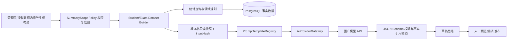

# 后续优化、AI 学习总结与教务系统融合统一方案

> 编制日期：2026-07-16  
> 当前分支：codex/p1-architecture-refactor  
> 基线提交：1eb50e5  
> 适用项目：在线考试与教学管理平台

## 1. 总体结论

项目下一阶段不需要更换技术栈，也不应重新做一次大范围目录重构。建议继续使用 NestJS 11、Prisma 6、PostgreSQL、Vue 3、Vite 和 Orval，把系统沿着三条相互依赖的主线推进：

1. **工程质量继续收紧**：解决剩余大型页面、统计查询、宽泛 OpenAPI 响应类型和大导出内存问题。
2. **AI 从通用文本总结升级为业务总结**：先支持“选择考试生成考试总结”，再支持“选择学生生成学习总结”；AI 只解释平台计算出的事实，不参与判分和数据写入。
3. **教务能力分阶段并入主平台**：以 worker_01 为迁移源，按档案与班级、排课、考勤与课时、教学记录与门户、Scratch 课堂的顺序迁移。

最终目标是：

- 一个产品入口、一个账号权限体系、一个 PostgreSQL 业务事实源；
- 考试、题库、教务、课堂记录和 AI 分析共享同一课程、班级和学生上下文；
- Hydro、Scratch 等专业运行时保持独立，通过适配器和任务接口接入；
- 不保留永久双写、第二套登录或第二套教务数据库。

## 2. 当前基线与剩余问题

### 2.1 已完成并应保持的能力

- 题库、考试、学生考试、Hydro、导出、试卷、用户和阅卷的大型 Service 已按用例拆分。
- 重点 Vue 页面已进入 feature、components、composables、models 和 api 分层。
- 路由已懒加载，ECharts、CodeMirror、KaTeX 已独立分包。
- Swagger、OpenAPI、Orval 和自定义 Fetch 适配器已经落地。
- Hydro 与 AI 密钥使用版本化 AES-256-GCM 加密。
- 已具备 PostgreSQL 导出任务租约、对象存储接口、Prometheus 指标、健康检查和结构化日志。
- 已有 56 个单元测试、8 个集成测试和 5 个浏览器流程测试。
- AI 已具备超级管理员配置中心、8 个国产模型预设、最小连接测试和通用文本总结。

### 2.2 当前代码规模

当前代码实时复核结果：

| 指标 | 当前值 |
| --- | ---: |
| Prisma model | 50 |
| Prisma enum | 25 |
| 后端模块目录 | 24 |
| Controller | 21 |
| OpenAPI 路径 | 172 |
| OpenAPI 操作 | 206 |

仍需处理的主要热点：

| 文件或领域 | 当前规模/现状 | 后续建议 |
| --- | ---: | --- |
| PublicQuestionView.vue | 787 行 | 拆公共检索、题目展示、练习状态 |
| UserManagementView.vue | 773 行 | 拆用户、角色、权限和批量操作 |
| WrongQuestionView.vue | 758 行 | 拆筛选、练习、掌握状态和生成试卷 |
| PaperAnswerView.vue | 675 行 | 复用统一作答布局和答案状态 |
| statistics.service.ts | 663 行 | 拆统计口径、考试分析和知识点分析查询 |
| ClassView.vue | 601 行 | 为教务融合先拆班级档案和成员关系 |
| KnowledgeView.vue | 571 行 | 拆树查询、编辑和批量维护 |
| 生成客户端响应 | 97 个模型仍依赖 ApiRecordDto/PageDto | 增加领域响应 DTO，继续减少字段漂移 |
| 大导出 | ZIP、PDF、DOCX 和部分 JSON 仍整包缓冲 | 改为分批装载和流式写文件 |

这些问题不阻塞现有系统运行，但会直接影响 AI 数据接入和教务模块开发，应在新领域大量增加前处理掉。

## 3. 统一优先级

| 优先级 | 工作包 | 主要目的 |
| --- | --- | --- |
| P0 | 领域响应 DTO 与 AI 数据权限边界 | 防止新增 AI/教务接口继续使用宽泛类型或越权数据 |
| P0 | AI 考试总结 MVP | 用现有稳定考试数据验证业务总结闭环 |
| P0 | 教务阶段 0 数据盘点 | 冻结 worker_01 数据字典、附件和迁移口径 |
| P1 | AI 学生学习总结 | 汇总多场考试、错题和知识点趋势 |
| P1 | 剩余页面和统计服务拆分 | 为教务页面和 AI 数据查询腾出清晰边界 |
| P1 | 身份档案、家长关系和班级花名册 | 建立教务统一身份基础 |
| P1 | 排课、考勤和不可变课时台账 | 建立教务核心事务 |
| P1 | 大导出流式化、性能和索引基线 | 支撑历史数据迁移与大规模报表 |
| P2 | 教学记录、学生/家长门户 | 贯通课堂过程数据 |
| P2 | AI 总结加入考勤、课时和课堂表现 | 从考试分析升级为完整学习过程总结 |
| P2 | Scratch 课堂适配与历史作品迁移 | 保留独立运行时，统一业务元数据 |

## 4. 后续代码优化建议

### 4.1 收紧 OpenAPI 响应类型

当前请求 DTO 已较完整，但大量响应仍落到 ApiRecordDto 和 ApiRecordPageDto。它们只能表达 id、status 和 metadata，无法在后端字段变化时让前端编译失败。

建议按领域增加明确响应模型：

- QuestionListItemDto、QuestionDetailDto、QuestionDuplicateResultDto
- ExamListItemDto、ExamDetailDto、ExamResultDto、ExamStatisticsDto
- StudentAttemptDto、StudentResultDto、StudentLearningProfileDto
- ExportTaskDto、ExportAuditDto
- HydroAccountDto、HydroSubmissionDto、HydroTaskDto
- StudentProfileDto、LessonSessionDto、AttendanceDto、LessonHourLedgerDto
- AiStudentSummaryDto、AiExamSummaryDto、AiSummaryTaskDto

执行规则：

1. Controller 返回类型和 Swagger DTO 必须一致。
2. 分页统一使用 PageResult 的具体泛型包装。
3. Blob 下载继续声明 binary schema。
4. 时间、Decimal、JSON 和 nullable 字段在 feature API 映射层转换。
5. 新增业务接口禁止使用 ApiRecordDto；旧接口逐个替换。
6. CI 检查 OpenAPI 和 Orval 重新生成后无差异。

验收目标：新增 AI 和教务接口 100% 使用明确 DTO；现有 97 个宽泛响应按领域逐步清零。

### 4.2 拆分剩余大型前端页面

优先顺序：

1. **ClassView**：先迁入 features/classes，拆成员列表、教师配置、课程关系和详情面板，为教务花名册扩展做好准备。
2. **UserManagementView**：拆账号生命周期、角色分配、权限目录和密码操作。
3. **WrongQuestionView**：拆错题筛选、练习会话、掌握状态、复习提醒和错题组卷。
4. **PaperAnswerView**：复用 ExamTaking 的答案模型、导航和材料题组件。
5. **PublicQuestionView**：拆公开筛选、题目详情和匿名练习。
6. **KnowledgeView**：拆树状态、节点表单和批量移动。

约束：

- 路由 View 控制在 100 行左右，只做页面编排。
- 页面协调 composable 不超过约 500 行，核心 composable 建议 200–350 行。
- 组件不直接导入 Orval generated API，不拼接业务 URL。
- 不通过把完整旧页面移动到一个大组件来“满足”行数要求。

### 4.3 拆分统计查询

statistics.service.ts 建议按统计口径拆为：

- overview.query.ts
- score-distribution.query.ts
- exam-comparison.query.ts
- question-diagnostics.query.ts
- knowledge-mastery.query.ts
- student-trend.query.ts
- wrong-question-analysis.query.ts
- statistics-scope.policy.ts

AI 数据构建器只能依赖这些确定性查询，不应自己复制 SQL 或在提示词中计算平均分、排名和正确率。

每个统计结果应带：

- 数据范围和筛选条件；
- 统计时间点；
- 样本数；
- 明确口径版本；
- 可追踪的 sourceRef。

### 4.4 大导出流式化

建议分两步处理：

第一步：

- CSV、JSON 使用逐行写入，避免先拼接完整字符串。
- ExcelJS 使用 streaming workbook writer。
- PDFKit 直接 pipe 到暂存文件，不再 Buffer.concat。
- 数据查询使用稳定游标或固定批次读取。

第二步：

- ZIP 入口允许 Buffer 或文件流，附件不再 readFile 后整体驻留内存。
- DOCX 如受库能力限制继续产生 Buffer，应限制单任务数据量并单独记录峰值。
- 全量归档按领域分段生成临时文件，再流式写入 ZIP。
- 加入 1 万题、10 万答题记录和多附件场景的峰值内存基线。

验收目标：大导出峰值内存不随附件总大小线性增长；任务可重试且不会留下重复对象。

### 4.5 数据库与性能

- 为题目列表、考试结果、学生趋势、课次日历和课时台账建立真实 P95 基线。
- 对 Top 20 慢查询执行 EXPLAIN ANALYZE BUFFERS。
- 分页排序必须包含唯一键，避免翻页重复。
- AI 数据集查询一次性返回聚合数据，避免逐学生或逐题 N+1。
- 教务模型优先建立以下约束：
  - LessonSession(sourceRuleId, startsAt) 唯一；
  - AttendanceRecord(sessionId, studentId) 唯一；
  - LessonHourLedger(idempotencyKey) 唯一；
  - ParentStudent(parentId, studentId) 唯一；
  - LegacyIdMapping(sourceSystem, entityType, sourceId) 唯一。

### 4.6 安全与运维

- 继续保持生产 Swagger 默认关闭、强 Secret 启动校验和日志敏感字段脱敏。
- 修复依赖扫描中可安全升级的低/中风险项，高风险继续作为 CI 阻断条件。
- 为 AI 增加调用次数、Token、耗时、错误类型和预算指标，不记录输入正文。
- 为教务增加排课失败、重复课次、考勤冲突、课时对账差异和迁移差异指标。
- 多实例、共享文件或任务强可靠需求出现后，再切换 BullMQ/Redis 和 MinIO/S3。

## 5. AI 总结业务方案

### 5.1 推荐顺序

建议先做**考试总结**，再做**学生学习总结**。

原因：

- 单场考试的数据边界清晰，平均分、分布、题目正确率和知识点薄弱项都能确定性计算。
- 结果容易人工核对，适合建立第一批 AI 评测样本。
- 学生总结需要跨考试、错题、知识点和时间范围聚合，权限与数据口径更复杂。
- 教务融合后，学生总结还会继续加入考勤、课时、课堂表现和作业，因此应先设计可扩展的数据快照。

### 5.2 两种总结用例

| 用例 | 用户选择 | 确定性输入 | AI 输出 |
| --- | --- | --- | --- |
| 学生学习总结 | 学生、课程、时间范围、可选考试 | 考试成绩趋势、知识点掌握、错题、题型表现、编程判题、未完成项 | 学习概况、优势、薄弱点、风险、下一步建议 |
| 考试总结 | 考试、可选班级/学生范围 | 参考率、提交率、均分、中位数、分数分布、及格率、题目诊断、知识点诊断 | 考试质量、共性问题、区分度提示、教学建议、需复核项 |

教务融合后，学生总结可追加：

- 出勤率、迟到/请假/缺勤趋势；
- 实际课次和课时消耗；
- 教学目标完成情况；
- 课堂表现、作业和下次计划；
- Scratch 作品提交、批阅和版本进展。

### 5.3 核心原则：事实由系统算，AI 只负责解释

禁止把原始答卷直接交给模型并让模型自己计算：

- 平均分、排名、及格率、正确率；
- 学生考试次数和趋势；
- 错题次数和知识点统计；
- 考勤次数和课时余额；
- 是否提交、是否缺考和是否完成作业。

这些数据必须由 PostgreSQL 查询和领域规则计算，再形成只读摘要快照。AI 只能基于快照生成语言表达、归纳和建议。

AI 不得：

- 修改题目答案、学生分数、排名或阅卷结果；
- 写入考勤、课时台账和课堂记录；
- 自动发布给学生或家长；
- 把猜测写成平台事实；
- 输出快照中不存在的具体分数、次数或身份信息。

### 5.4 推荐调用链



建议新增：

- StudentSummaryDatasetBuilder
- ExamSummaryDatasetBuilder
- AiSummaryScopePolicy
- AiSummaryPromptRegistry
- AiSummarySchemaValidator
- AiSummaryUseCases
- AiSummaryWorker

当前超级管理员通用总结接口继续作为配置测试工具；教师和学生业务流程不得直接复用该超级管理员接口。

### 5.5 结构化输出

模型应返回结构化 JSON，而不是一段不可验证的长文本。推荐结构：

```json
{
  "headline": "本次学习/考试的核心结论",
  "overview": "简短概述",
  "strengths": [
    { "title": "优势", "detail": "说明", "evidenceRefs": ["metric:knowledge:loops"] }
  ],
  "risks": [
    { "level": "medium", "title": "风险", "detail": "说明", "evidenceRefs": ["metric:wrong:12"] }
  ],
  "actions": [
    { "priority": 1, "title": "建议行动", "detail": "具体执行方式" }
  ],
  "disclaimer": "AI 生成，需由教师确认"
}
```

DeepSeek 和通义千问的官方接口均提供 JSON 结构化输出能力，但不同模型支持范围和参数可能不同：

- DeepSeek JSON Output：https://api-docs.deepseek.com/zh-cn/guides/json_mode/
- 通义千问结构化输出：https://help.aliyun.com/en/model-studio/qwen-structured-output

因此应在 provider capability registry 中记录：

- 是否支持 response_format；
- 是否支持 json_object/json_schema；
- 是否支持流式输出；
- 上下文窗口和最大输出；
- thinking 模式与结构化输出是否兼容。

不支持结构化输出的模型使用“JSON 提示词 + 本地 Schema 校验 + 一次修复”策略；修复失败则返回可重试错误，不把半截内容保存为正式结果。

### 5.6 权限和发布规则

建议新增权限：

- ai.summary.student.generate
- ai.summary.exam.generate
- ai.summary.review
- ai.summary.publish
- ai.summary.view-own
- ai.summary.view-class
- ai.summary.manage-templates

权限矩阵：

| 角色 | 生成 | 查看 | 发布 |
| --- | --- | --- | --- |
| SUPER_ADMIN | 全部 | 全部 | 全部 |
| ADMIN/教务 | 授权组织范围 | 授权范围 | 需具备发布权限 |
| TEACHER | 任教班级、负责考试和学生 | 任教范围 | 默认仅发布给授权学生 |
| STUDENT | 默认不直接生成 | 仅本人已发布总结 | 不允许 |
| PARENT | 不允许 | 仅关联子女已发布总结 | 不允许 |

所有范围由服务端关系推导。前端传入 studentId、examId 或 classId 不能成为授权依据。

### 5.7 API 建议

| 方法 | 路径 | 用途 |
| --- | --- | --- |
| POST | /api/v1/ai-summaries/exams | 选择考试生成总结任务 |
| POST | /api/v1/ai-summaries/students | 选择学生和范围生成总结任务 |
| GET | /api/v1/ai-summaries/tasks/:id | 查询任务状态与用量 |
| GET | /api/v1/ai-summaries/:id | 获取草稿或已发布总结 |
| POST | /api/v1/ai-summaries/:id/regenerate | 使用新模板或模型重新生成 |
| PATCH | /api/v1/ai-summaries/:id | 教师编辑标题、概述和建议 |
| POST | /api/v1/ai-summaries/:id/publish | 发布给学生/家长 |
| POST | /api/v1/ai-summaries/:id/revoke | 撤回发布 |
| GET | /api/v1/students/:id/ai-summaries | 获取某学生授权总结 |
| GET | /api/v1/exams/:id/ai-summaries | 获取某考试历史总结 |

考试请求示例字段：

- examId
- classId（可选）
- includeQuestionDiagnostics
- includeKnowledgeDiagnostics
- additionalInstruction（受限长度）

学生请求示例字段：

- studentId
- courseId（可选）
- startDate、endDate
- examIds（可选，未提供时按范围选择）
- includeWrongQuestions
- includeProgrammingResults
- additionalInstruction

### 5.8 数据模型建议

#### AiSummaryTask

- id、type：STUDENT/EXAM
- subjectId：studentId 或 examId
- scopeJson：课程、班级、时间和考试范围
- inputHash：确定性快照哈希，用于幂等和缓存
- datasetVersion、promptVersion、schemaVersion
- providerConfigId、modelSnapshot
- status、attemptCount、correlationId
- createdBy、createdAt、startedAt、finishedAt
- inputTokens、outputTokens、estimatedCost
- errorCode、sanitizedError

#### AiSummary

- id、taskId、type、subjectId
- summaryJson：通过 Schema 校验的结构化结果
- sourceSnapshotJson：只保存必要聚合指标，不保存密码、Token、完整答案正文
- draftVersion、editedBy、editedAt
- reviewStatus、reviewedBy、reviewedAt
- publishedAt、revokedAt
- expiresAt（可选）

#### AiPromptTemplate

- code、summaryType、version
- systemPrompt、outputSchema
- enabled、createdBy、reviewedBy
- changeReason、createdAt

提示模板变更需要版本化，历史总结必须能追溯到原模板、模型和输入快照。

### 5.9 成本与稳定性控制

- 默认只发送聚合数据，不发送所有学生完整答案和题目全文。
- 相同 inputHash、promptVersion、model 的成功结果可复用，避免重复计费。
- 考试总结建议上限 800–1200 输出 Token；学生总结建议 500–800。
- 为每个操作者、组织和自然日设置调用次数与 Token 预算。
- 429、超时和 5xx 只允许有限退避重试；鉴权、余额不足和参数错误不自动重试。
- 大考试使用一次聚合总结，不为每名学生自动发起模型调用。
- 调用进入幂等任务队列；页面轮询任务状态或使用 SSE，HTTP 请求不无限等待。
- 保留 provider、model、Token、耗时、结果状态和 inputHash，不记录 API Key 和原始敏感输入。
- 可配置主模型和备用模型，但切换必须保留模型快照并在页面标识。

### 5.10 产品页面建议

#### 考试总结

入口放在考试结果/统计页：

1. 选择考试和班级范围。
2. 先展示系统确定性统计预览。
3. 选择总结模板和输出长度。
4. 生成 AI 草稿。
5. 教师核对 evidenceRefs 对应的指标。
6. 编辑、导出或发布。

页面应同时展示：

- 参考人数、提交率、均分、中位数和分布；
- 难题/易题、区分度提示、知识点薄弱项；
- AI 概述、优势、风险和教学行动建议；
- 数据时间、样本数、模板版本、模型和“AI 生成”标识。

#### 学生学习总结

入口放在学生档案和班级学生详情：

1. 选择学生、课程和时间范围。
2. 可勾选具体考试。
3. 展示成绩趋势、知识点、错题和编程结果预览。
4. 生成 AI 草稿并由教师确认。
5. 可发布到学生端；教务融合后可发布到家长端。

不建议默认批量生成全校学生总结。批量任务必须显式选择范围、显示预计调用量并二次确认。

### 5.11 AI 验收标准

- 每个总结中的具体数字都能由 evidenceRef 定位到数据快照。
- 模型不得生成快照中不存在的成绩、排名、次数和身份信息。
- JSON Schema 解析成功率达到 99% 以上；失败不发布。
- 至少建立 50 个脱敏黄金样本，覆盖高分、低分、缺考、小样本和异常分布。
- 教师对总结的事实正确性、可操作性和语气进行评分。
- 学生、家长和非任课教师的越权路径全部返回 403。
- 相同输入重复提交不重复计费或生成重复任务。
- AI 服务不可用时，确定性统计仍正常显示和导出。
- 所有发布结果明确标识 AI 生成和人工审核状态。

## 6. 教务系统融合方案

### 6.1 融合结论

教务能力适合并入当前平台，但应迁移业务能力和数据，不直接复制 Flask 代码。

目标形态：

- 当前平台是唯一产品主入口。
- PostgreSQL 是身份、课程、班级、课次、考勤、课时和课堂记录的唯一事实源。
- worker_01 是首选迁移源和验收对照，切换后只读归档。
- class_worker 只作历史参考，不独立迁移。
- hydro_scratch、hydro_points、hydro-objrand 保持 Hydro 插件/独立运行时边界。
- Scratch/Hydro 写入通过本地事务、outbox/任务和幂等回调完成，不跨 HTTP 事务。

### 6.2 领域模块

复用现有：

- User、Auth、Role、Permission
- Course、ClassGroup、ClassStudent、ClassTeacher
- FileAsset、ObjectStorage
- Notification、AuditLog
- ExportTask
- HydroAccount、ExternalOjPlatform

新增：

- student-profiles
- teacher-profiles
- parent-relations
- lesson-catalog
- lesson-scheduling
- attendance
- lesson-hours
- teaching-records
- classroom-assets
- scratch-classroom
- legacy-import

每个模块继续使用 Controller + query/command use cases + policy 的边界，不增加全局 EduService。

### 6.3 核心数据设计

| 领域 | 建议实体 | 关键规则 |
| --- | --- | --- |
| 学生档案 | StudentProfile | User 唯一关联，不复制登录字段 |
| 教师档案 | TeacherProfile | 任课状态与账号权限分离 |
| 家长关系 | ParentStudent | 组合唯一，服务端推导可见学生 |
| 课程目录 | LessonType、CourseUnitTemplate | 课型与备课模板不等于具体课次 |
| 排课 | ClassScheduleRule、LessonSession | 规则生成课次，重复生成幂等 |
| 考勤 | AttendanceRecord | 每课次每学生唯一，支持更正 |
| 课时 | LessonHourLedger | 不可变台账，余额必须可重建 |
| 教学记录 | LessonRecord、LessonAsset | 草稿/发布和字段可见性 |
| Scratch | Template、Assignment、Work、Version、Review、JudgeRun | 作品版本不可变，外部回调幂等 |
| 迁移 | LegacyIdMapping、MigrationRun | 可重跑、可追踪、可生成差异报告 |

考勤确认和课时扣减必须处于同一 PostgreSQL 事务。任何撤销或更正通过反向台账处理，不能删除历史流水或直接修改余额。

### 6.4 分阶段实施

#### 阶段 0：源数据和治理基线，约 1 周

- 确认 worker_01 实际生产数据库、版本、数据量和附件目录。
- 冻结源 Schema，建立可恢复备份和校验和。
- 输出字段级数据字典、数据分类和脱敏样例。
- 明确身份冲突、课时余额、归档和历史保留口径。
- 清理旧 Secret，确认跨仓代码授权与归档策略。

退出条件：源表行数、附件数、总大小和恢复演练均有证据。

#### 阶段 1：身份档案与班级花名册，约 1–2 周

- 实现 StudentProfile、TeacherProfile、ParentStudent。
- 扩展班级成员生命周期字段。
- 建立教务权限和数据范围。
- 实现只读迁移预检、LegacyIdMapping 和冲突报告。
- 上线学生档案、教师档案和班级花名册。

退出条件：教师、学生和家长的数据范围全部通过拒绝路径测试。

#### 阶段 2：排课、考勤和课时，约 2–3 周

- 实现 LessonType、CourseUnitTemplate、ScheduleRule 和 LessonSession。
- 实现考勤确认、更正、补课和反向课消。
- 实现不可变 LessonHourLedger、余额缓存和全量对账。
- 上线日历、点名和课时流水。

退出条件：重复点名不重复扣费；余额可从台账重建；批量生成课次不重复。

#### 阶段 3：教学记录、资源和门户，约 2 周

- 实现 LessonRecord、LessonAsset。
- 接入通知、审计和对象存储。
- 上线学生课次详情和家长子女视图。
- 将 AI 学生总结扩展到考勤、课堂表现和作业。

退出条件：未发布记录不可见；附件不可越权；AI 引用的数据范围与门户权限一致。

#### 阶段 4：Scratch 课堂，约 2–3 周

- 实现模板、任务、作品版本、批阅和 JudgeRun。
- 通过适配器对接 hydro_scratch。
- 迁移模板、作品和批阅，附件按 SHA-256 去重。
- 覆盖超时、重复回调、失败重试和降级。

退出条件：外部运行时不可用时主平台事务不损坏，作品版本和回调均可追踪。

#### 阶段 5：演练、切换和归档，约 1–2 周

1. 用最新备份执行全量迁移演练。
2. 输出身份、余额、附件和行数差异报告。
3. 处理人工冲突并完成业务签字。
4. worker_01 进入维护模式，停止写入。
5. 执行最终增量、幂等导入和自动化回归。
6. 切换统一入口，worker 保持只读观察。
7. 观察期通过后关闭旧写服务并归档仓库。

禁止在观察期后继续维护双写。

### 6.5 迁移规则

- 账号按强标识匹配；仅姓名相同必须人工确认。
- 不复制旧密码；无法兼容时走首次激活或重置密码。
- 每个源主键保存 LegacyIdMapping 和 sourceHash。
- 课时余额先迁移为 OPENING_BALANCE 台账，再逐学生对账。
- 附件先校验存在性、大小和 SHA-256，再进入对象存储。
- 删除状态默认转为归档，不丢失已关联考勤、课时、考试和作品。
- 迁移脚本只负责数据转换，不能反向决定长期 Prisma Schema。
- 每次 MigrationRun 保存输入版本、数量、成功、跳过、冲突和失败明细。

### 6.6 AI 与教务数据的结合

教务并入后，学生总结的数据优先级应为：

1. 考试成绩、知识点、错题和编程判题；
2. 出勤、迟到、请假和缺勤；
3. 课次完成、课堂目标、表现和作业；
4. Scratch 作品提交、版本和教师批阅；
5. 课时仅用于运营提示，不把余额多少解释为学习能力。

考试总结仍以考试事实为主，不应因为教务接入而混入无关考勤数据。若需要分析“出勤与成绩关系”，必须作为独立统计报告，明确样本量和相关不代表因果。

### 6.7 主要风险

| 风险 | 缓解措施 |
| --- | --- |
| 学生身份误合并 | 强标识自动匹配，姓名冲突人工确认 |
| 课时口径争议 | 阶段 0 冻结规则，逐学生对账，不可变台账 |
| 家长/教师越权 | 服务端范围策略、403 拒绝测试和审计 |
| AI 编造事实 | 确定性快照、evidenceRefs、Schema 校验和人工发布 |
| AI 成本失控 | inputHash 去重、预算、聚合调用和限量批处理 |
| 大迁移占用内存 | 分批读取、流式附件和可恢复 MigrationRun |
| 外部 Scratch/Hydro 不稳定 | 本地事务、任务适配、超时、幂等和降级 |
| 新教务模块再次巨型化 | 用例拆分、文件预算和架构门禁 |
| 永久双写 | 单向绞杀迁移，明确冻结和关闭日期 |

## 7. 统一实施路线图

建议以迭代为单位安排：

| 迭代 | 工程优化 | AI | 教务 |
| --- | --- | --- | --- |
| 1 | 新接口明确响应 DTO；拆 statistics 查询 | 考试总结数据集、权限、Schema 和黄金样本 | worker 数据盘点、备份、数据字典 |
| 2 | 拆 ClassView/UserManagementView | 考试总结生成、预览、编辑和发布 | Student/Teacher/Parent 档案模型 |
| 3 | 拆 WrongQuestion/PaperAnswer | 学生跨考试总结与 inputHash 去重 | 班级花名册、权限和迁移预检 |
| 4 | CSV/JSON/PDF 流式化 | 总结任务队列、预算和指标 | 排课、课次和日历 |
| 5 | ZIP/附件流式化、数据库 P95 | AI 评测、反馈和模型能力注册 | 考勤、课时台账和对账 |
| 6 | 剩余页面与宽泛 DTO 清理 | 学生端已发布总结 | 教学记录、资源和家长门户 |
| 7–8 | 稳定性与容量演练 | 加入教务维度的学习总结 | Scratch 适配、迁移和全量切换演练 |

推荐先交付的最小闭环：

1. 考试结果页选择一场考试。
2. 后端生成确定性 ExamSummaryDataset。
3. 展示统计预览。
4. 调用 AI 返回结构化草稿。
5. 教师核对、编辑和发布。
6. 学生端只查看已发布结果。

完成这个闭环后，再复用同一任务、模板、Schema、权限和发布体系实现学生总结。

## 8. 统一验收指标

### 工程

- 新增用例/服务原则上不超过 500 行。
- 新路由 View 不超过约 100 行。
- 新业务接口不使用 ApiRecordDto。
- OpenAPI、Orval、vue-tsc、Lint、构建和架构门禁全部通过。
- 新核心用例行覆盖不低于 80%，关键策略分支覆盖不低于 90%。

### AI

- 具体数字 100% 可追踪到 evidenceRef。
- AI 不写分数、考勤和课时数据。
- 越权生成/查看/发布均被拒绝并记录审计。
- 相同 inputHash 不重复计费。
- 模型不可用时统计和导出仍可用。
- 正式发布必须经过人工确认并带 AI 标识。

### 教务

- worker 主要业务表和附件均有明确迁移处置。
- 重复点名、重复回调和重复迁移不产生重复副作用。
- 课时余额可由台账完整重建。
- 家长只能查看明确关联的学生。
- worker 切换后不再写入，主平台成为唯一事实源。

### 运维

- 每个 AI 任务、迁移批次、导出任务和外部运行时调用都有 correlationId。
- 指标覆盖成功率、延迟、Token、成本、迁移差异、课时对账和任务积压。
- 数据库、文件和迁移均具备恢复演练记录。

## 9. 明确不建议

- 不因教务模块增多立即拆微服务。
- 不把 worker_01 Flask 应用永久作为第二个后端。
- 不直接复制旧 Raw SQL 和数据库兼容层。
- 不让教师业务接口复用超级管理员通用 AI 总结接口。
- 不让 AI 计算或修改成绩、考勤和课时。
- 不默认批量为全校学生生成总结。
- 不把完整答案、手机号、密码、Token 或无关个人信息发送给模型。
- 不把 AI 总结当作唯一证据或自动发布。
- 不直接把课时余额存成可随意修改的学生字段。
- 不删除历史 Prisma migration 或生产业务数据。
- 不在没有多实例和共享存储需求时提前增加 Redis、BullMQ 和 MinIO 的部署负担。

## 10. 建议立即启动的十项工作

1. 决定考试总结首版的输出字段和教师发布流程。
2. 新增 ExamSummaryDataset DTO 和确定性数据构建器。
3. 定义 AI Summary JSON Schema、evidenceRef 格式和提示模板版本。
4. 增加 AI 业务权限、范围策略和拒绝路径测试。
5. 建立 50 个脱敏考试总结黄金样本。
6. 为 statistics.service.ts 拆分查询口径。
7. 拆分 ClassView，为教务花名册预留 feature 边界。
8. 获取 worker_01 真实生产库和附件只读快照，产出字段级数据字典。
9. 明确学生身份冲突和课时余额迁移规则。
10. 完成考试总结 MVP 后，再实现学生跨考试总结，并为后续教务数据保留扩展字段。

按此顺序推进，可以先用现有考试数据快速验证 AI 的实际价值，同时完成教务迁移最关键的数据准备；不会让 AI、统计和教务三个方向各自建立重复的数据查询、权限和任务体系。
