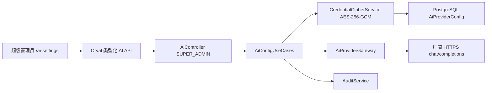

# AI 模型配置与总结技术说明

> 实施日期：2026-07-15
> 适用分支：`codex/p1-architecture-refactor`

## 1. 实施结论

系统已增加仅超级管理员可用的 AI 配置中心和文本总结能力。实现继续遵循模块化单体边界，不引入新的常驻 Python 服务、SDK 或第二套密钥系统；各厂商统一通过 OpenAI-compatible `chat/completions` 协议接入。

管理入口为 `/ai-settings`，后端接口位于 `/api/v1/ai/*`。普通管理员、教师、学生和未登录用户均不能读取配置、测试连接或调用总结。

## 2. 支持的预设

预设只负责填充厂商、Base URL 和建议模型，管理员仍可按控制台实际开通情况修改模型名。模型版本会随厂商迭代，正式上线前应以各厂商官方控制台和文档为准。

| 厂商 | Base URL | 当前预设模型 | 官方文档 |
| --- | --- | --- | --- |
| DeepSeek | `https://api.deepseek.com` | `deepseek-v4-flash` | [DeepSeek API](https://api-docs.deepseek.com/) |
| 阿里云百炼/通义千问 | `https://dashscope.aliyuncs.com/compatible-mode/v1` | `qwen3.6-plus` | [百炼 Base URL](https://help.aliyun.com/zh/model-studio/base-url) |
| 火山方舟/豆包 | `https://ark.cn-beijing.volces.com/api/v3` | `doubao-seed-2-0-lite-260215` | [方舟 OpenAI SDK](https://www.volcengine.com/docs/82379/1795150) |
| 智谱 GLM | `https://open.bigmodel.cn/api/paas/v4` | `glm-5.1` | [智谱 OpenAI SDK](https://docs.bigmodel.cn/cn/guide/develop/openai/introduction) |
| Moonshot/Kimi | `https://api.moonshot.cn/v1` | `kimi-k2.6` | [Kimi Quickstart](https://platform.kimi.com/docs/api/quickstart) |
| MiniMax | `https://api.minimaxi.com/v1` | `MiniMax-M2.7` | [MiniMax OpenAI API](https://platform.minimaxi.com/docs/api-reference/text-chat-openai) |
| 百度智能云千帆 | `https://qianfan.baidubce.com/v2` | `deepseek-v3.1-250821` | [千帆 OpenAI 兼容接口](https://cloud.baidu.com/doc/qianfan-api/s/3m7of64lb) |
| 腾讯混元 | `https://api.hunyuan.cloud.tencent.com/v1` | `hunyuan-turbos-latest` | [混元 OpenAI 兼容接口](https://cloud.tencent.com/document/product/1729/111007) |

不同地域的 Key 与端点可能不能混用；豆包部分场景需要将模型名改为控制台中的推理接入点 ID。

## 3. 架构和调用链

- `AiController`：声明授权边界和明确响应 DTO。
- `AiConfigUseCases`：持有配置事务、默认配置选择、连接测试、总结和审计。
- `AiProviderGateway`：统一 HTTPS、超时、DNS 私网阻断、禁止重定向、响应大小和响应结构校验。
- `CredentialCipherService`：使用与 Hydro 凭据相同的版本化 AES-256-GCM 密钥体系，但使用独立 AAD：`ai-provider:<configId>`。
- 前端 `features/ai`：包含 `api`、`models`、`composables`、`components`，路由 View 只负责编排。

## 4. 数据模型

`AiProviderConfig` 保存：

- 配置名、厂商标识、Base URL、模型名；
- `apiKeyCiphertext`、`apiKeyIv`、`apiKeyAuthTag`、`apiKeyKeyVersion`；
- 启用、默认、超时、最大输出 Token；
- 最近一次连接测试状态、时间和脱敏消息；
- 创建人、更新人和时间戳。

接口永远不返回 API Key 或密文，只返回固定掩码和 `hasApiKey`。更新时 API Key 留空表示保持原密钥。删除配置会直接删除密文，不维护明文或双轨字段。

## 5. API

| 方法 | 路径 | 用途 |
| --- | --- | --- |
| GET | `/api/v1/ai/presets` | 获取内置厂商预设 |
| GET | `/api/v1/ai/configurations` | 获取脱敏配置列表 |
| POST | `/api/v1/ai/configurations` | 创建并加密保存配置 |
| PATCH | `/api/v1/ai/configurations/:id` | 修改配置或轮换 Key |
| DELETE | `/api/v1/ai/configurations/:id` | 删除配置 |
| POST | `/api/v1/ai/configurations/:id/test` | 发送一次 `只回复：OK` 的 4 Token 连接测试 |
| POST | `/api/v1/ai/summary` | 生成管理员文本总结 |

总结输入最多 20,000 字符，附加要求最多 500 字符，单次输出最多 1,200 Token，且不会突破配置自身的最大 Token 限制。审计只记录输入字符数、模型、Token 用量和耗时，不保存总结原文或待总结内容。

## 6. 安全控制

1. Controller 统一要求 `SUPER_ADMIN`，并有学生拒绝路径集成测试。
2. Base URL 必须为 HTTPS，不能包含用户名、密码、查询参数或片段。
3. 拒绝 localhost、私网、链路本地地址和解析到私网的域名；请求禁止 HTTP 重定向。
4. 出站请求有 3–120 秒超时，响应体无论是否提供 `Content-Length` 均限制为 2 MiB。
5. 第三方错误响应不原样返回，避免回显 Key、提示词或用户输入。
6. Pino 对 `apiKey`、Authorization、Cookie、Token、密码、答案正文等字段进行脱敏。
7. API Key 使用版本化 AES-256-GCM 加密；生产环境必须通过 `CREDENTIAL_ENCRYPTION_KEYS` 管理密钥，不把 Key 写入 `.env.example`、日志、Git 或前端存储。

DNS 校验显著降低 SSRF 风险，但生产环境仍应在网络层对应用容器配置出站域名/网段策略，防御 DNS rebinding 和供应链端点被接管。

## 7. 管理操作流程

1. 使用超级管理员登录，进入“AI 配置”。
2. 选择预设，核对地域、Base URL 和模型名。
3. 输入 API Key，设置超时与最大 Token，先保存为停用状态。
4. 点击一次“连接测试”；成功后再启用并设为默认。
5. 在同页使用少量非敏感文本验证总结。
6. 轮换 Key 时只填写新 Key；轮换后再做一次最小测试，旧 Key 立即在厂商控制台撤销。

## 8. 测试和验收

- 单元测试覆盖 HTTPS/私网拒绝、DNS 解析私网拒绝、请求上限、响应解析和错误脱敏。
- 集成测试覆盖超级管理员访问、学生 403、密钥不出现在响应、数据库仅保存密文。
- OpenAPI 和 Orval 客户端纳入差异检查。
- AI 页面纳入 `vue-tsc`、ESLint、架构守卫和懒加载检查。
- 真实厂商测试必须显式使用管理员提供的 Key；自动化测试只使用假 Key且不发出真实模型请求。

## 9. 后续演进

- 对不同厂商的速率限制、余额不足、上下文窗口和内容安全错误建立标准化错误码。
- 当总结进入学生或教师业务流程时，新增独立权限和数据最小化策略，不直接复用超级管理员接口。
- 需要可追溯生成时再增加脱敏后的提示模板版本、审批和结果保留策略；默认不存储输入正文。
- 需要高并发或长任务时，将调用封装为幂等后台任务并接入既有队列接口，不在 HTTP 请求中无限等待。
