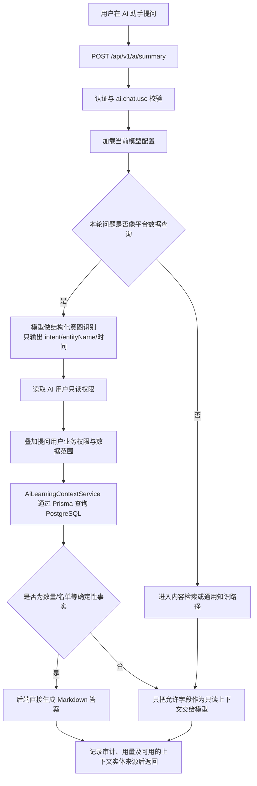

# 当前系统 AI 查询平台数据的逻辑与工作流

日期：2026-07-24
适用分支：`codex/ai-edu-fusion`

## 1. 结论

当前系统的 AI 查询不是读取页面文字，也不是拿前端接口返回值再分析。

AI 助手统一调用后端 `POST /api/v1/ai/summary`。对疑似平台数据查询，后端先尝试让模型做受约束的查询意图识别；不满足分类条件或分类失败时，由本地规则保守分流。随后由 `AiLearningContextService` 通过 Prisma 直接查询当前 PostgreSQL 数据库。数量、名单、最高分、空班级、教案列表等平台事实由后端确定性生成，不交给模型猜测。

只有题目/试卷讲解、通用知识或需要自然语言组织的内容才会把经过权限过滤的数据交给模型。模型不能自行访问数据库，也不能调用任意平台接口。

## 2. 三种回答路径

| 路径 | 适用问题 | 数据取得方式 | 最终答案由谁生成 |
| --- | --- | --- | --- |
| 平台事实直答 | 数量、名单、归属、时间、冲突、最高/最低分、教案统计与列表 | 后端通过 Prisma 直接查询 PostgreSQL | 后端按固定 Markdown 模板生成，模型不改数值 |
| 平台内容检索后回答 | 题目、试卷讲解等 | 后端通过 Prisma 检索并裁剪允许字段，再作为只读上下文发给模型 | 模型依据已提供的数据组织答案 |
| 通用知识回答 | 不依赖平台当前事实的概念、原理、学习方法 | 当前实现仍可能按关键词检索已授权题目或试卷；未命中平台内容时不依赖业务数据 | 模型回答，但必须具备 `ai.chat.general-knowledge` |

当用户询问平台当前事实但权限不足时，后端直接返回权限提示；当平台查询失败或没有数据时，不允许模型补猜一个结果。

## 3. 当前请求工作流



### 3.1 意图识别

入口位于 `AiGenerationUseCases.classifyPlatformQuery()`。

- 只判断本轮用户问题；最近历史仅用于解析“这个考试”“刚才那个班级”等明确指代。
- 对明显的平台数据问题调用当前选中的模型做一次小型分类，输出固定 JSON，不让分类器直接回答。
- 当前支持的意图包括班级、教师/学生归属、排课冲突、空闲教室、考试成绩极值、题库数量、考试时间、教案查询等。
- 如果分类模型超时、额度不足或返回非法 JSON，后端仍使用本地正则规则做保守匹配。
- “写一份、生成、设计、制作教案”等内容生成请求明确排除平台教案检索。

模型在这里的作用是理解语义，不是查询数据库或计算最终数量。

### 3.2 权限计算

AI 查询权限由以下几层共同决定：

1. 当前登录用户必须能使用 AI 问答；
2. `AI 用户（ai_user）`必须启用对应读取权限和 `ai.data.*` 数据域开关；
3. 涉及班级、考试、教案、实名等受限数据时，当前登录用户还必须拥有对应业务读取权限；
4. 教师、助教、学生和家长继续受 `DataScopeService` 的班级、学生和考试范围限制；
5. 超级管理员和管理员的数据范围不受班级限制；
6. AI 用户只有读取、下载、预览类权限，不能新增、修改、删除或发布内容。

可以把受限业务数据的判断理解为：

```text
允许查询 =
当前用户业务读取权限
AND AI 用户对应业务读取权限
AND AI 用户 ai.data.* 开关
AND 当前用户数据范围允许
```

`AI 用户`默认拥有与超级管理员相同的全部读取类权限，但不复制超级管理员的写权限。AI 用户也不是可登录账号，不能被分配给普通用户。

题库和试卷的学习内容检索另有发布状态保护：没有直接答案权限时只检索已发布内容，并移除答案、正确选项和解析。

## 4. 数据从哪里来

后端在同一 NestJS 进程中注入 `PrismaService`，直接访问 PostgreSQL。它没有先调用课程、教案或考试的 REST Controller，也不分析前端表格或其他接口的 JSON。

| 查询能力 | Prisma 数据模型 | PostgreSQL 主要表 | 当前使用的数据 |
| --- | --- | --- | --- |
| 教案数量与列表 | `LessonPlan`、`Course`、`KnowledgePoint` | `lesson_plans`、`courses`、`knowledge_points` | 来源、课程、课题、知识点、作者、删除状态 |
| 班级及空班级 | `ClassGroup`、`ClassStudent`、`ClassTeacher` | `classes`、`class_students`、`class_teachers` | 启用班级、课程、有效学生和教师关系 |
| 未分班学生 | `User`、`ClassStudent`、`ClassGroup` | `users`、`class_students`、`classes` | 有效学生及有效班级归属 |
| 教师带班情况 | `User`、`ClassTeacher`、`ClassGroup` | `users`、`class_teachers`、`classes` | 有效教师/助教和所带启用班级 |
| 排课冲突与教室占用 | `LessonSession`、`ClassScheduleRule` | `lesson_sessions`、`class_schedule_rules` | 课次时间、教师、班级和教室字段 |
| 考试时间与成绩极值 | `Exam`、`ExamAttempt`、`User` | `exams`、`exam_attempts`、`users` | 考试范围、已评分作答、每名学生最高分 |
| 题库数量与内容 | `Question` 及题目关联模型 | `questions` 等 | 删除/发布状态、题干、选项、知识点及受控答案字段 |
| 试卷内容 | `Paper`、`PaperSection`、`PaperQuestion` | `papers`、`paper_sections`、`paper_questions` | 试卷状态、结构和允许查看的题目字段 |

所有查询都在后端执行。前端只提交问题并展示后端响应。

## 5. 教案查询的当前规则

### 5.1 可见范围

- 超级管理员、管理员：查询所有未删除教案；
- 教师、助教等受限用户：只查询系统通用教案和本人个人教案；
- 仍需同时通过 `lesson-plan:read`、`ai.data.lesson-plans` 和 AI 用户全局读取上限。

### 5.2 模糊查询

默认采用不区分大小写的包含匹配，同时检查：

- 教案课题 `LessonPlan.theme`；
- 课程名称 `Course.name`；
- 知识点名称 `KnowledgePoint.name`。

例如：

```text
课程Python Basic相关教案
```

会模糊匹配 `Python Basic`。用户截图对应的数据快照为 4 份；最终验收时数据库已新增两份个人教案，因此实时查询返回 6 份。答案以请求发生时的数据库事实为准，不固定沿用截图数字。

### 5.3 精确查询

问题中包含“精确查询”“准确查询”或“完全匹配”时，三个字段改用不区分大小写的完整名称匹配。

例如：

```text
精确查询课程“Python Basic”的教案数量
```

最终验收数据库实测返回 6 份；精确查询 `Python` 返回 0 份。截图时的 4 份是当时数据快照，并非写死的期望值。

### 5.4 数量与列表

- `XX 的教案数量`：使用 Prisma `count()`取得精确总数，使用 `groupBy(source)`取得系统/个人数量；
- `列出 XX 的教案`或`XX 相关教案`：在数量基础上查询最近更新的结果，并按系统教案、个人教案分别编号列出；
- 列表最多展示最近更新的 200 份；如果总数超过展示数，答案会明确标注总数和截断数量，统计本身不受 200 条限制。

## 6. 为什么不让模型直接查数

模型适合做语义理解和自然语言组织，但不适合独立承担平台事实计算。当前系统把职责拆开：

- 模型判断用户是在查平台数据、生成内容还是问通用知识；
- 后端权限层决定允许查询什么；
- Prisma 和 PostgreSQL提供实时事实；
- 后端对数量、名单和分组做确定性计算；
- 模型只在确实需要表达和讲解时使用经过裁剪的只读上下文。

因此，模型不会因为页面上恰好显示 4 行就推断数量，也不会根据历史回答沿用旧数字。

## 7. 审计与失败处理

- 意图分类和正式模型回答分别记录 Token 用量；
- 平台事实直答、权限阻止和模型生成使用不同审计动作；
- 审计记录包含意图分类以及可用的上下文实体来源，但不记录管理员验证密码；数量直答等路径可能没有实体来源记录，当前也不保存完整 SQL 或查询条件；
- AI 用户角色缺失或停用时按无权限处理，不自动放行；
- 平台事实没有查询结果时返回 0 或明确的无数据结论，不由模型补充；
- 模型收到的平台内容标记为“不可信只读业务数据”，其中的提示注入文本不能覆盖系统规则。

## 8. 新增模块接入 AI 查询的要求

新增功能不能只增加页面或 Controller。若需要被 AI 查询，必须同时完成：

1. 新增独立业务读取权限并登记到权限目录；
2. 新增对应 `ai.data.*` 数据域开关；
3. 在 AI 数据权限页展示该数据域；
4. 在 `AiLearningContextService`增加确定性查询和数据范围限制；
5. 在意图分类目录和本地保守匹配中登记查询意图；
6. 明确哪些字段可以发给模型，哪些事实由后端直接回答；
7. 添加允许、拒绝、数据范围、模糊/精确匹配和无数据测试；
8. 执行权限目录检查、单元测试、集成测试和真实 API 验收。

读取类权限在权限同步时会自动补给 AI 用户；管理员已手动关闭的旧权限不会被同步重新开启。

## 9. 关键实现位置

- API 入口：`src/modules/ai/ai.controller.ts`
- 查询编排与意图识别：`src/modules/ai/ai-generation.use-cases.ts`
- 平台数据查询与确定性回答：`src/modules/ai/ai-learning-context.service.ts`
- AI 用户权限读取：`src/modules/ai/ai-user-permission.service.ts`
- AI 数据域权限交集：`src/modules/ai/ai-data-permission.service.ts`
- 当前用户数据范围：`src/modules/data-scope/data-scope.service.ts`
- AI 用户管理：`src/modules/users/commands/role-management.use-cases.ts`
- 权限自动同步：`scripts/sync-permissions.ts`

针对“查看某份教案”“总结某份教案”等更细粒度意图的现状分析与后续改进方案，见
[当前系统 AI 查询智能化改进计划](./2026-07-24-ai-query-intelligence-improvement-plan.md)。完整的结构化查询计划、详情、摘要、比较和候选澄清方案尚未实施。
