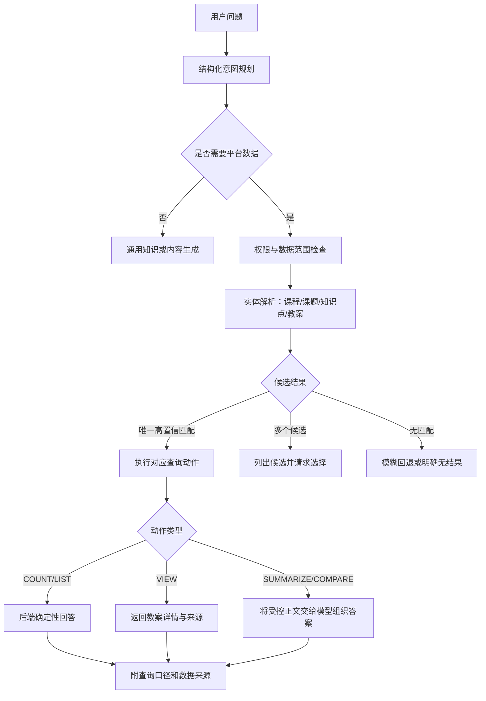

# 当前系统 AI 查询智能化改进计划

日期：2026-07-24
状态：结构化查询计划及 `VIEW/SUMMARIZE/COMPARE` 尚未实施；当前分支仅完成“查看”动作词清洗、分类实体名优先和既有 `COUNT/LIST` 查询修正
依据：当前分支 `codex/ai-edu-fusion` 的实现逻辑及本轮用户截图

## 1. 目标与适用用户

目标：让 AI 助手先准确理解用户要“查数量、列名单、查看详情、总结内容还是生成新内容”，再选择正确的数据查询和回答方式，避免所有含“教案”的请求都返回教案统计。

主要用户：

- 超级管理员、管理员：查询全平台可见数据；
- 教师、助教：查询系统教案及本人有权查看的个人教案；
- 后续接入其他平台数据查询的用户。

成功标准：

- `查看 Loops 教案`能够找到并展示 Loops 教案，而不是查询“查看loops”并返回 0；
- `Loops 教案进行简单总结`能够读取匹配教案正文并做摘要，而不是返回数量统计；
- 数量、列表、详情、摘要和内容生成五类请求不会互相混淆；
- 模糊查询、精确查询和歧义澄清都有可预测结果；
- 所有事实仍由数据库查询提供，模型不能猜测平台数据或越权读取。

## 2. 截图暴露的问题

### 2.1 `查看loops教案`返回 0

截图对应版本的关键词清洗没有去掉“查看”，后端实际拿“查看loops”做模糊匹配。当前分支已去除该动作词，并优先使用分类器返回的 `entityName`，因此 `查看 Loops 教案`可以按 `Loops`检索。

这不是权限问题，也不是数据库没有数据，而是“动作词”和“实体名称”没有分离。当前局部修正仍只进入既有统计/名称列表路径，并不等于已实现教案详情查看。

### 2.2 `Loops教案进行简单总结`仍返回教案统计

当前只有一个 `LESSON_PLAN_OVERVIEW` 教案意图，数量、列表、详情和总结共用同一路径。请求中只要被判断为平台教案查询，就进入 `lessonPlanContext()`；该方法只会生成统计答案。

分类器成功提取 `Loops`时，当前分支会优先使用该实体名；分类失败并回退到本地规则时，“进行简单总结”仍可能污染检索词。无论哪种情况，当前都没有 `SUMMARIZE`动作和正文读取能力，因此仍只能返回统计或名称列表。

### 2.3 即使匹配到，也无法真正总结

当前教案查询只读取：

- `id`
- `theme`
- `source`

它没有读取教案正文 `content`、课程、知识点和更新时间。后端因此只能回答数量和标题，无法把实际教案内容提供给模型进行摘要。

### 2.4 当前意图分类粒度不足

当前平台分类器能判断“这是教案查询”，但不能稳定区分：

- 统计数量；
- 列出名称；
- 查看某一份详情；
- 总结某一份内容；
- 比较多份教案；
- 生成一份新教案。

模型的语义理解结果没有被转换成一份可验证的查询计划，后端只能依赖正则和关键词删除。

## 3. 推荐方向：结构化查询计划，而不是暴露思维过程

“让 AI 思考”建议实现为受约束的结构化计划，不要求模型输出内部推理过程。模型只返回后端可验证的 JSON：

```json
{
  "needsPlatformData": true,
  "domain": "lesson_plan",
  "action": "SUMMARIZE",
  "entityText": "Loops",
  "matchMode": "AUTO",
  "outputShape": "SHORT_SUMMARY",
  "needsContent": true,
  "confidence": 0.96
}
```

后端必须校验枚举、字段长度、权限和动作是否受支持。模型不能在计划中指定任意 SQL、表名、URL 或权限绕过条件。

## 4. 建议的目标工作流



### 4.1 第一步：拆分动作与实体

建议动作枚举：

| 动作 | 示例 | 预期行为 |
| --- | --- | --- |
| `COUNT` | Python 教案有多少 | 返回精确总数和来源分组 |
| `LIST` | 列出 Python 教案 | 分组列出名称 |
| `VIEW` | 查看 Loops 教案 | 找到唯一教案并展示详情 |
| `SUMMARIZE` | 简单总结 Loops 教案 | 读取正文后生成摘要 |
| `COMPARE` | 对比 Loops 和 Variables 教案 | 读取两份正文并按指定维度比较 |
| `GENERATE` | 写一份 Loops 教案 | 不查询现有教案统计，进入生成流程 |
| `GENERAL` | 什么是循环教学 | 不依赖平台当前数据 |

动作词不能进入实体名称。例如：

```text
查看loops教案
```

应解析为：

```text
action = VIEW
entityText = Loops
```

而不是：

```text
entityText = 查看loops
```

### 4.2 第二步：实体解析与匹配策略

推荐使用“精确优先、模糊回退、歧义澄清”：

1. 统一全半角、空格和大小写；
2. 提取引号中的名称作为高优先级实体；
3. 按教案课题、课程名称、知识点名称做精确匹配；
4. 没有精确结果且模式不是 `EXACT` 时再做包含匹配；
5. 仍无结果时可使用受控的相似度匹配；
6. 只有一个高置信候选时自动继续；
7. 多个候选不能任选一个，应列出课程、课题、来源供用户选择；
8. 用户明确要求精确查询时不得自动降级到模糊结果。

建议匹配结果携带：

- 教案 ID；
- 教案课题；
- 课程；
- 知识点；
- 系统/个人来源；
- 作者；
- 最近更新时间；
- 匹配字段和匹配方式；
- 置信度。

### 4.3 第三步：按动作读取最少数据

- `COUNT`：只执行 `count/groupBy`，不读取正文；
- `LIST`：读取标题、课程、知识点、来源和更新时间；
- `VIEW`：读取选定教案的结构化正文；
- `SUMMARIZE`：读取选定正文并裁剪到模型上下文允许范围；
- `COMPARE`：限制教案数量和单份正文长度，避免一次读取过多；
- `GENERATE`：使用课程、知识点和用户补充要求构建生成上下文，不误用统计流程。

### 4.4 第四步：确定性事实与模型表达分离

后端负责：

- 权限和数据范围；
- 匹配结果；
- 数量和分组；
- 候选排序；
- 实际教案正文；
- 数据来源和更新时间。

模型负责：

- 摘要；
- 对比；
- 重点提炼；
- 面向用户的自然语言表达。

模型不得修改数量、来源、教案名称或数据库返回的事实字段。

## 5. 推荐的模块边界

规划层建议放在 AI 模块，但把各业务域查询交给独立适配器：

```text
AiPlatformQueryPlanner
  -> 生成并校验结构化查询计划

AiPlatformQueryExecutor
  -> 权限检查、执行计划、统一错误和来源信息

LessonPlanAiQueryAdapter
  -> 教案匹配、数量、列表、详情和正文读取

AiLearningContextService
  -> 组合允许发送给模型的只读上下文

AiGenerationUseCases
  -> 决定本地直答或调用模型，记录审计与用量
```

这样可以避免继续把所有领域、意图、查询和 Markdown 格式堆到同一个 `AiLearningContextService` 中。

业务数据仍建议由后端通过 Prisma 读取，但适配器必须复用或严格对齐现有业务服务的数据可见规则，不能因为绕过 REST Controller 而产生另一套口径。

## 6. 用户体验与回答格式

### 6.1 正常结果

`查看 Loops 教案`建议返回：

```markdown
## Loops

- 课程：Python Basic
- 来源：系统教案
- 知识点：循环
- 最近更新：2026-07-24

### 教学目标
...
```

`Loops 教案进行简单总结`建议返回：

```markdown
## Loops 教案简要总结

这份教案围绕循环结构展开，重点包括……

- 教学目标：……
- 核心活动：……
- 课堂重点：……
- 建议课时：……

数据来源：平台教案库 / Python Basic / Loops
```

### 6.2 空结果

明确说明实际使用的条件：

```text
没有找到课题、课程或知识点完整匹配“Loops”的教案。
是否改用模糊查询？
```

不能只说“0 份”而不说明匹配词和匹配模式。

### 6.3 多候选

例如存在多个 `Loops`：

```text
找到 3 份名称相近的教案，请选择：
1. Python Basic / Loops / 系统教案
2. Python 进阶 / Nested Loops / 系统教案
3. Python Basic / Loops 复习 / 我的教案
```

### 6.4 权限不足

应区分：

- 当前用户没有教案读取权限；
- AI 用户关闭了教案读取；
- 教案存在但不在当前用户数据范围；
- 可以查询列表，但不允许读取正文。

不向无权用户泄露不可见教案是否存在。

### 6.5 加载与失败

- 意图识别时显示“正在理解问题”；
- 数据查询时显示“正在检索平台数据”；
- 摘要生成时显示“正在阅读并总结教案”；
- 模型失败但数据库查询成功时，保留教案详情并提示“摘要生成失败，可重试”，不丢失已经取得的事实。

## 7. 分阶段实施计划

### 阶段 1：意图与实体正确性

目标：解决截图中的直接误判。

- 拆分 `COUNT/LIST/VIEW/SUMMARIZE/COMPARE/GENERATE`；
- 引入结构化查询计划 DTO 和严格校验；
- 动作词、格式词与实体名称分离；
- 历史只用于明确指代，不污染本轮动作；
- 为低置信度和多候选定义澄清流程。

### 阶段 2：教案详情与摘要

目标：真正支持“查看”和“总结”。

- 教案查询适配器增加详情和正文读取；
- 为正文定义允许发送给模型的字段；
- `VIEW`由后端返回结构化详情；
- `SUMMARIZE`将选定正文作为只读上下文交给模型；
- 回答中显示教案名称、课程、来源和更新时间。

### 阶段 3：统一平台查询执行器

目标：把同样的智能查询模式扩展到考试、班级、排课等模块。

- 建立领域能力注册表；
- 每个能力声明动作、权限、数据范围、查询适配器和回答方式；
- 新功能加入读取权限时，同时登记 AI 查询能力；
- 不支持的动作明确返回能力边界，不让模型自行编造。

### 阶段 4：质量评估与观测

目标：用数据证明改进，不靠主观感觉。

- 建立真实中文问法集和期望查询计划；
- 记录计划、匹配方式、候选数、最终数据来源和用户纠正；
- 统计意图准确率、实体准确率、零结果误报率、澄清率和越权阻止率；
- 将本轮截图对应问法加入永久回归样本。

## 8. 验收标准

### 意图与实体

- `查看loops教案`解析为 `VIEW + Loops`；
- `Loops教案进行简单总结`解析为 `SUMMARIZE + Loops`；
- `列出 Python Basic 相关教案`解析为 `LIST + Python Basic + FUZZY`；
- `精确查询课程“Python Basic”的教案数量`解析为 `COUNT + Python Basic + EXACT`；
- `写一份 Loops 教案`解析为 `GENERATE`，不进入平台统计。

### 查询与回答

- 唯一匹配的 `VIEW`返回对应教案详情；
- `SUMMARIZE`的内容能追溯到选定教案正文；
- 数量使用数据库精确计数，列表数量和分组一致；
- 多候选时不擅自选取；
- 精确查询无结果时不自动冒充模糊结果；
- 模糊查询结果标明匹配方式；
- 无结果提示包含实际查询词和恢复建议。

### 权限与安全

- AI 用户关闭教案读取后，所有教案动作均被阻止；
- 普通用户不能通过摘要或候选列表推断不可见教案；
- 模型不能请求额外字段、执行写操作或绕过数据范围；
- 审计记录查询计划、动作、候选和来源，不记录密码或完整敏感正文。

### 回归样本

至少覆盖：

- 中英文混排和大小写；
- `查看/打开/读一下/总结/概括/对比/列出/多少/生成`；
- 有空格、无空格、引号、错别字和简称；
- 唯一匹配、多匹配、无匹配；
- 系统教案、本人个人教案、他人不可见个人教案；
- 追问“总结第一份”“换成第二份”“只看系统的”。

## 9. 非目标

本计划不包含：

- 让模型输出或保存内部思维过程；
- 允许模型编写 SQL 或直接连接数据库；
- 允许 AI 自动修改、删除或发布教案；
- 在没有来源数据时让模型猜测平台事实；
- 一次性重写所有现有 AI 总结功能。

## 10. 推荐下一步

先将本计划拆为可独立验收的实施任务，优先完成阶段 1 和阶段 2。第一批任务应只覆盖教案域，并用本轮两张失败截图的问法作为红灯测试；验证稳定后再推广到考试、班级和排课。

本文件规划的查询规划器、动作拆分、教案详情、正文摘要、比较和候选澄清尚未实现；当前分支仅包含上述局部实体识别与既有 `COUNT/LIST` 查询修正。
